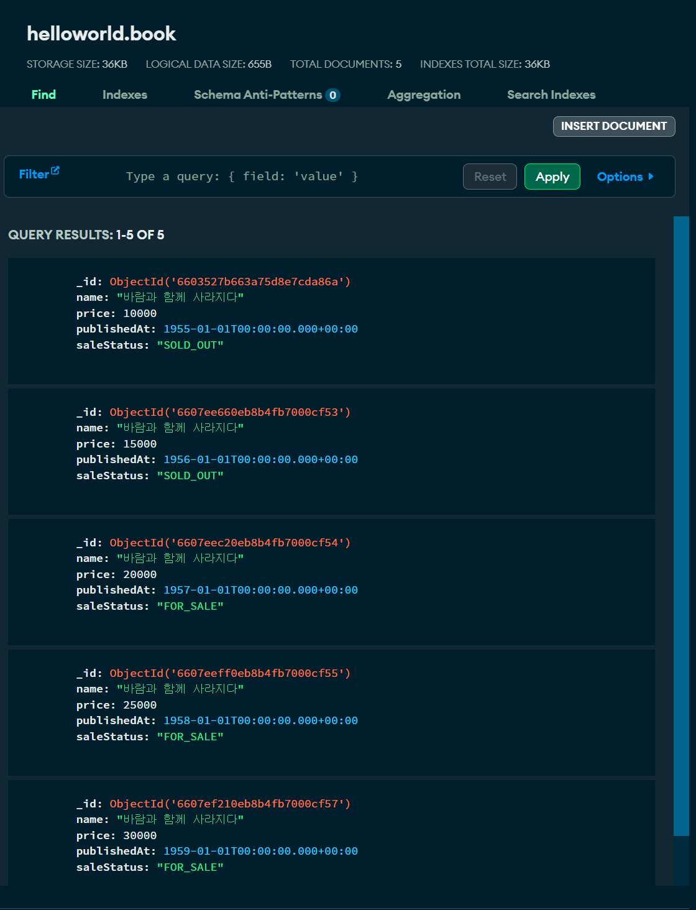
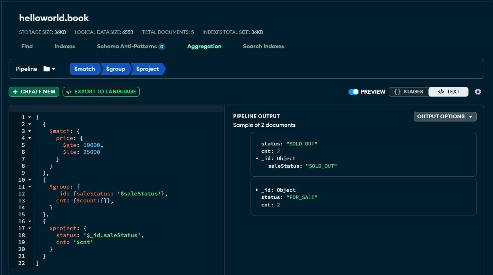

## Aggregation Pipeline

Aggregation Pipeline 을 spring data mongodb reactive 기반으로 작성할 때에는 `@Aggregation` 을 사용해서 작성하는 방식이 있고, MongoTemplate 을 이용해 Java 코드를 작성하는 방식도 있습니다. 이번 문서에서는 두가지 예제를 모두 정리합니다.<br/>

- @Aggregation 을 이용한 방식
- MongoTemplate 을 이용해 Aggregation 을 수행하는 방식

<br/>


## 참고자료

@Aggregation 관련 자료들

- [Spring Data Reactive MongoDB aggregation pipeline](https://boottechnologies-ci.medium.com/spring-data-reactive-mongodb-aggregation-pipeline-924e90ce1e79) , [github - spring-reactve-mongodb-aggregation](https://github.com/anicetkeric/spring-reactive-mongodb-aggregation/tree/main)
  - [InvoiceRepository.java](https://github.com/anicetkeric/spring-reactive-mongodb-aggregation/blob/main/src/main/java/com/example/springreactivemongodbaggregation/repository/InvoiceRepository.java)
  - [InvoiceCountSummary.java](https://github.com/anicetkeric/spring-reactive-mongodb-aggregation/blob/main/src/main/java/com/example/springreactivemongodbaggregation/model/InvoiceCountSummary.java)
  - [Invoice.java](https://github.com/anicetkeric/spring-reactive-mongodb-aggregation/blob/main/src/main/java/com/example/springreactivemongodbaggregation/document/Invoice.java)
  - [src/main/resources/initdb/invoice.js](https://github.com/anicetkeric/spring-reactive-mongodb-aggregation/blob/main/src/main/resources/initdb/invoice.js)

<br/>


Aggregation Query 

- [mongodb.com - MongoDB Aggregation Operations](https://www.mongodb.com/docs/manual/aggregation/)
  - [$count(aggregation accumulator)](https://www.mongodb.com/docs/manual/reference/operator/aggregation/count-accumulator/)
  - [$sum(aggregation)](https://www.mongodb.com/docs/manual/reference/operator/aggregation/sum/)

- [Mongo group and push: pushing all fields](https://stackoverflow.com/questions/22150205/mongo-group-and-push-pushing-all-fields)
- [how to use mongodb aggregate and retrieve entire documents](https://stackoverflow.com/questions/22359742/how-to-use-mongodb-aggregate-and-retrieve-entire-documents)
- [MongoDB Aggregation error : Pipeline stage specification object must contain exactly one field](https://stackoverflow.com/questions/42232375/mongodb-aggregation-error-pipeline-stage-specification-object-must-contain-exa)
- [$group (aggregation)](https://www.mongodb.com/docs/manual/reference/operator/aggregation/group/)
- [Learn How to Use Group in MongoDB Aggregation Pipeline](https://betterprogramming.pub/learn-how-to-use-group-in-mongodb-aggregation-pipeline-8fd007ad492f)

<br/>


Spring Data MongoDB BigDecimal Support

- [Spring Data MongoDB BigDecimal support](https://stackoverflow.com/questions/37950296/spring-data-mongodb-bigdecimal-support)
- [jsonobject.tistory.com/466](https://jsonobject.tistory.com/466) 


## Aggregation 이란?


## 샘플 데이터

이번 예제에서 사용할 샘플 데이터는 아래와 같습니다. helloworld 라는 데이터베이스가 있고 이 데이터베이스 안의 `book` 이라는 컬렉션을 예제로 사용합니다. 그리고 데이터를 자세히 보면, "바람과 함께 사라지다" 라는 책이 다양한 종류로 존재하며 가격은 10000, 15000, 20000, 25000, 30000 원대가 있으며, 판매 상태는 `SOLD_OUT`, `FOR_SALE` 이 존재함을 알 수 있습니다.<br/>



<br/>


## Aggregation pipeline

오늘 Java 코드로 구현해볼 Aggregation pipeline 은 아래와 같습니다.<br/>

10000원 \~ 25000원 사이의 가격이면서, `saleStatus` 가 `FOR_SALE` 인 것은 몇개인지, `SOLD_OUT` 인 것은 몇개인지 집계 코드를 통해 체크하는 예제입니다.<br/>

```json
[
  {
  	$match: {
    	price: {
      	$gte: 10000,
      	$lte: 25000
    	}
  	}
	},
  {
    $group: {
    	_id: {saleStatus: '$saleStatus'},
    	cnt: {$count:{}},
  	}
  },
  {
    $project: {
      status: '$_id.saleStatus',
      cnt: '$cnt'
    }
  }
]
```

이 Aggregation pipeline 을 실행한 결과는 아래와 같습니다.



<br/>


## MongoTemplate 설정

### MongoReactiveConfiguration.java

설명은 생략하겠습니다.

```java
package io.chagchagchag.example_mongo.mongodb_reactive_example.examples.config;

import com.mongodb.reactivestreams.client.MongoClient;
import com.mongodb.reactivestreams.client.MongoClients;
import java.math.BigDecimal;
import java.util.Arrays;
import org.bson.json.StrictJsonWriter;
import org.bson.types.Decimal128;
import org.springframework.beans.factory.annotation.Value;
import org.springframework.boot.autoconfigure.mongo.MongoProperties;
import org.springframework.context.annotation.Bean;
import org.springframework.context.annotation.Configuration;
import org.springframework.data.mongodb.ReactiveMongoDatabaseFactory;
import org.springframework.data.mongodb.ReactiveMongoTransactionManager;
import org.springframework.data.mongodb.core.ReactiveMongoTemplate;
import org.springframework.data.mongodb.core.SimpleReactiveMongoDatabaseFactory;
import org.springframework.data.mongodb.core.convert.MongoConverter;
import org.springframework.data.mongodb.core.convert.MongoCustomConversions;

@Configuration
public class MongoReactiveConfiguration {
  @Value("${spring.data.mongodb.uri}")
  private String mongoUri;

  @Bean
  public MongoClient reactiveMongoClient(){
    return MongoClients.create(mongoUri);
  }

  @Bean
  public ReactiveMongoTransactionManager transactionManager(
      ReactiveMongoDatabaseFactory dbFactory
  ){
    return new ReactiveMongoTransactionManager(dbFactory);
  }

  @Bean(name = "helloworldReactiveMongoDatabaseFactory")
  public SimpleReactiveMongoDatabaseFactory helloworldReactiveMongoDatabaseFactory(
      MongoProperties mongoProperties,
      MongoClient mongoClient
  ){
    // 이렇게 할 수도 있지만, 하나의 프로젝트에서 여러 몽고 database 를 사용할 수 있으므로 비활성화
//    String database = mongoProperties.getMongoClientDatabase();
    final String database = "helloworld";
    return new SimpleReactiveMongoDatabaseFactory(mongoClient, database);
  }

  @Bean(name = "helloworldReactiveMongoTemplate")
  public ReactiveMongoTemplate helloworldReactiveMongoTemplate(
      ReactiveMongoDatabaseFactory helloworldReactiveMongoDatabaseFactory,
      MongoConverter mongoConverter
  ){
    return new ReactiveMongoTemplate(helloworldReactiveMongoDatabaseFactory, mongoConverter);
  }

  @Bean
  public MongoCustomConversions mongoCustomConversions(){
    return new MongoCustomConversions(
        Arrays.asList(
            new BigDecimalToDecimal128Converter(),
            new Decimal128ToBigDecimalConverter()
        )
    );
  }

}
```

<br/>

### BigDecimalToDecimal128Converter.java

```java
package io.chagchagchag.example_mongo.mongodb_reactive_example.examples.config;

import java.math.BigDecimal;
import org.bson.types.Decimal128;
import org.springframework.core.convert.converter.Converter;

public class BigDecimalToDecimal128Converter implements Converter<BigDecimal, Decimal128> {
  @Override
  public Decimal128 convert(BigDecimal source) {
    return source == null ? null : new Decimal128(source);
  }
}
```

<br/>


### Decimal128ToBigDecimalConverter.java

```java
package io.chagchagchag.example_mongo.mongodb_reactive_example.examples.config;

import java.math.BigDecimal;
import org.bson.types.Decimal128;
import org.springframework.core.convert.converter.Converter;

public class Decimal128ToBigDecimalConverter implements Converter<Decimal128, BigDecimal> {
  @Override
  public BigDecimal convert(Decimal128 source) {
    return source == null ? null : source.bigDecimalValue();
  }
}
```

<br/>


### Repository Scan 설정

MongodbReactiveExampleApplication.java

```java
package io.chagchagchag.example_mongo.mongodb_reactive_example;

import org.springframework.boot.SpringApplication;
import org.springframework.boot.autoconfigure.SpringBootApplication;
import org.springframework.data.mongodb.repository.config.EnableReactiveMongoRepositories;

@EnableReactiveMongoRepositories(
		basePackages = {
				"io.chagchagchag.example_mongo.mongodb_reactive_example.examples.book",
		},
		reactiveMongoTemplateRef = "helloworldReactiveMongoTemplate"
)
@SpringBootApplication
public class MongodbReactiveExampleApplication {

	public static void main(String[] args) {
		SpringApplication.run(MongodbReactiveExampleApplication.class, args);
	}

}
```

<br/>


## Document

Document 는 아래와 같습니다. 설명은 생략합니다.

### BookDocument.java

```java
package io.chagchagchag.example_mongo.mongodb_reactive_example.examples.book;

import java.math.BigDecimal;
import java.time.LocalDateTime;
import lombok.Getter;
import org.bson.types.ObjectId;
import org.springframework.data.mongodb.core.mapping.Document;
import org.springframework.data.mongodb.core.mapping.Field;
import org.springframework.data.mongodb.core.mapping.FieldType;

@Getter
@Document(collection = "book")
public class BookDocument {
  private ObjectId id;
  private String name;
  @Field(targetType = FieldType.DECIMAL128)
  private BigDecimal price;
  private LocalDateTime publishedAt;
  private SaleStatus saleStatus;
}
```


## @Aggregation 을 이용한 코드 

### BookDocumentAggregateRepository.java

```java
package io.chagchagchag.example_mongo.mongodb_reactive_example.examples.book;

import java.math.BigDecimal;
import org.bson.types.ObjectId;
import org.springframework.data.mongodb.repository.Aggregation;
import org.springframework.data.mongodb.repository.ReactiveMongoRepository;
import reactor.core.publisher.Flux;

public interface BookDocumentAggregateRepository extends ReactiveMongoRepository<BookDocument, ObjectId> {
  @Aggregation(pipeline = {
      "{ $match: {price: {$gte: ?0, $lte:  ?1}} }",
      "{ $group: {_id:  {saleStatus: '$saleStatus'}, cnt: {$count: {}}}}",
      "{ $project:  {status: '$_id.saleStatus', cnt: '$cnt'}}"
  })
  Flux<BookCountAggregate> aggregateGroupByStatusAndCounting(BigDecimal lowerLimit, BigDecimal upperLimit);
}
```

- `$match` : lowerLimit \~ upperLimit 의 범위에 해당하는 데이터들을 찾습니다.
- `$group` : `saleStatus` 로 group by 합니다. 그리고 각 Status 별 Counting 을 합니다.
- `$project` : 반환값인 `BookCountAggregate` 에 맞게끔 projection 을 하는 표현식입니다.

<br/>

위 코드에서 사용한 `BookCountAggregate` 는 아래와 같습니다.<br/>

<br/>


### BookCountAggregate.java

```java
package io.chagchagchag.example_mongo.mongodb_reactive_example.examples.book;

public record BookCountAggregate (
    String status,
    Double cnt
){
}
```

<br/>


### BookDocumentAggregationTest.java

```java
package io.chagchagchag.example_mongo.mongodb_reactive_example.examples.book.aggregation;

import io.chagchagchag.example_mongo.mongodb_reactive_example.examples.book.BookDocumentAggregateRepository;
import io.chagchagchag.example_mongo.mongodb_reactive_example.examples.book.BookDocumentRepository;
import io.chagchagchag.example_mongo.mongodb_reactive_example.util.DelayUtil;
import java.math.BigDecimal;
import java.util.stream.Collectors;
import org.junit.jupiter.api.DisplayName;
import org.junit.jupiter.api.Test;
import org.slf4j.Logger;
import org.slf4j.LoggerFactory;
import org.springframework.beans.factory.annotation.Autowired;
import org.springframework.boot.test.context.SpringBootTest;

// TODO : 문서작업 모두 끝나고 나면 TestContainers 버전으로 전환하기
@SpringBootTest
public class BookDocumentAggregationTest {
  private Logger log = LoggerFactory.getLogger(BookDocumentAggregationTest.class);

  @Autowired
  private BookDocumentRepository bookDocumentRepository;

  @Autowired
  private BookDocumentAggregateRepository bookDocumentAggregateRepository;
  
  @DisplayName("REMOTE_AGGREGATION_PIPELINE_책_제목으로_검색한_결과에_대해_SALE_STATUS_별_카운팅_집계를_수행")
  @Test
  public void TEST_REMOTE_AGGREGATION_PIPELINE_책_제목으로_검색한_결과에_대해_SALE_STATUS_별_카운팅_집계를_수행(){
    // given
    
    // when
    var b = bookDocumentAggregateRepository
        .aggregateGroupByStatusAndCounting(BigDecimal.valueOf(10000), BigDecimal.valueOf(25000))
        .toStream()
        .collect(Collectors.toList());

    b.stream().forEach(bookCountAggregate -> {
      log.info("status = " + bookCountAggregate.status());
      log.info("cnt = " + bookCountAggregate.cnt());
    });

    DelayUtil.delayMs(10*1000);
  }
}
```

<br/>


출력결과를 보면 `SOLD_OUT`, `FOR_SALE` 상태 각각에 대한 카운팅이 정상적으로 출력되었음을 확인 가능합니다.<br/>

<br/>


출력결과

```plain
2024-03-31T20:14:58.831+09:00  INFO 494364 --- [mongodb_reactive_example] [           main] .c.e.m.e.b.a.BookDocumentAggregationTest : status = SOLD_OUT
2024-03-31T20:14:58.831+09:00  INFO 494364 --- [mongodb_reactive_example] [           main] .c.e.m.e.b.a.BookDocumentAggregationTest : cnt = 2.0
2024-03-31T20:14:58.831+09:00  INFO 494364 --- [mongodb_reactive_example] [           main] .c.e.m.e.b.a.BookDocumentAggregationTest : status = FOR_SALE
2024-03-31T20:14:58.831+09:00  INFO 494364 --- [mongodb_reactive_example] [           main] .c.e.m.e.b.a.BookDocumentAggregationTest : cnt = 2.0

Process finished with exit code 0
```

<br/>


## MongoTemplate 을 이용해 Aggregation 을 수행하는 방식

> TODO : 정리 예정


