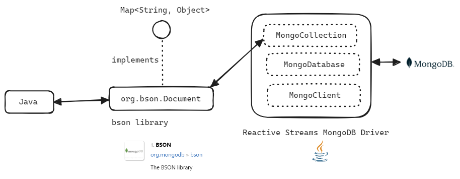

## Document, BSON, BSON Codec

## 참고자료

mongodb.com/docs/manual/reference/bson-types/

- [MongoDB Docs - BSON Types](https://www.mongodb.com/docs/manual/reference/bson-types/)

mongodb.github.io/mongo-java-driver

- [CodecProvider](https://mongodb.github.io/mongo-java-driver/5.0/apidocs/bson/org/bson/codecs/configuration/CodecProvider.html)
- [Quick Start Pojo](https://mongodb.github.io/mongo-java-driver/4.9/driver-reactive/getting-started/quick-start-pojo/)
- [org.bson.Document](https://github.com/mongodb/mongo-java-driver/blob/master/bson/src/main/org/bson/Document.java)

<br/>


## Document

BSON 에서 제공하는 타입에는 Document 라는 타입이 있습니다. 아래와 같이 MongoCollection 에 query 를 통해 조회한 결과는 `org.bson.Document` 로 변환됩니다.<br/>



<br/>

이  org.bson.[Document](https://github.com/mongodb/mongo-java-driver/blob/master/bson/src/main/org/bson/Document.java) 타입은 bson library 에 속하는 타입입니다. 

```java
package org.bson;

// ...
public class Document implements Map<String, Object>, Serializable, Bson {
    private static final Codec<Document> DEFAULT_CODEC =
            withUuidRepresentation(fromProviders(asList(new ValueCodecProvider(),
                    new CollectionCodecProvider(), new IterableCodecProvider(),
                    new BsonValueCodecProvider(), new DocumentCodecProvider(), new MapCodecProvider())), UuidRepresentation.STANDARD)
                    .get(Document.class);
    // ...
    
}
```

<br/>


## BSON

>  참고 : [MongoDB Docs - BSON Types](https://www.mongodb.com/docs/manual/reference/bson-types/)

아래 내용은 [MongoDB Docs - BSON Types](https://www.mongodb.com/docs/manual/reference/bson-types/) 의 내용 중 Java 자료형과, Bson 라이브러리에 존재하는 타입들에 대해서만 정리한 내용입니다. (DBPointer, Undefined 등의 타입들은 제외했습니다.)

| BSON Type          | Number | Java Type                                          |
| ------------------ | ------ | -------------------------------------------------- |
| Double             | 1      | Double, Float                                      |
| String             | 2      | Character, String, Enum                            |
| Object             | 3      |                                                    |
| Array              | 4      |                                                    |
| Binary Data        | 5      | Binary (bson 라이브러리 지원 타입), byte\[\]       |
| ObjectId           | 7      | ObjectId (bson 라이브러리 지원 타입)               |
| Boolean            | 8      | Boolean, AtomicBoolean                             |
| Date               | 9      | Date, Instant, LocalDate, LocalDateTime, LocalTime |
| Null               | 10     |                                                    |
| Regular Expression | 11     | Pattern                                            |
| JavaScript         | 13     | Code (bson 라이브러리 지원 타입)                   |
| 32-bit integer     | 16     | Integer, Byte, Short, AtomicInteger                |
| Timestamp          | 17     |                                                    |
| 64-bit integer     | 18     | Long, AtomicLong                                   |
| Decimal128         | 19     | Decimal128 (bson 라이브러리 지원 타입), BigDecimal |
| Min Key            | -1     | MinKey (bson 라이브러리 지원 타입)                 |
| Max Key            | 127    | MaxKey (bson 라이브러리 지원 타입)                 |
|                    |        |                                                    |

<br/>


## BSON Codec

예를 들면, MongoDB 로부터 Date 타입으로 전달되는 값을 LocalDate 또는 LocalDateTime 으로 변환해야 할 때가 있습니다. 또는 LocalDate, LocalDateTime 타입을 MongoDB driver 의 bson 라이브러리에서 지원하는 타입으로 변환해야 하는 경우가 있습니다.<br/>

이런 경우에 보통 기본제공되는 Provider 를 확장(extends) 해서 CodecProvider, Codec 을 직접 정의해서 사용합니다. 이번 섹션에서는 mongodb driver 에서 제공하는 bson 라이브러리의 코덱에는 어떤 것들이 있는지 정리해봅니다.<br/>

<br/>


### MongoClientSettings.DEFAULT\_CODEC\_REGISTRY

MongoClientSettings 클래스 내에서는 기본적으로 많이 사용되는 Codec 들의 Registry 를 CodecRegistry 타입의 `DEFAULT_CODEC_REGISTRY` 라는 필드를 통해 제공합니다.

Java 타입 관련 코덱 프로바이더들 

- ValueCodecProvider, IterableCodecProvider, MapCodecProvider, Jsr310CodecProvider, JsonObjectCodecProvider, JsonObjectCodecProvider, EnumCodecProvider, Jep395RecordCodecProvider, KotlinCodecProvider, CollectionCodecProvider

Bson 타입관련 코덱 프로바이더들

- DBRefCodecProvider,  DBObjectCodecProvider, DocumentCodecProvider, CollectionCodecProvider, GeoJsonCodecProvider, GridFSFileCodecProvider, BsonCodecProvider, ExpressionCodecProvider 

```java
@Immutable
public final class MongoClientSettings {
    private static final CodecRegistry DEFAULT_CODEC_REGISTRY =
            fromProviders(asList(new ValueCodecProvider(),
                    new BsonValueCodecProvider(),
                    new DBRefCodecProvider(),
                    new DBObjectCodecProvider(),
                    new DocumentCodecProvider(new DocumentToDBRefTransformer()),
                    new CollectionCodecProvider(new DocumentToDBRefTransformer()),
                    new IterableCodecProvider(new DocumentToDBRefTransformer()),
                    new MapCodecProvider(new DocumentToDBRefTransformer()),
                    new GeoJsonCodecProvider(),
                    new GridFSFileCodecProvider(),
                    new Jsr310CodecProvider(),
                    new JsonObjectCodecProvider(),
                    new BsonCodecProvider(),
                    new EnumCodecProvider(),
                    new ExpressionCodecProvider(),
                    new Jep395RecordCodecProvider(),
                    new KotlinCodecProvider()));
    // ...
}
```

<br/>

> 원래는 위의 코드에 List 내에 대입되는 Provider 객체들을 코드에서 선언한 순서대로 설명을 작성하려 했지만, Java 타입과 BSON 타입 설명이 섞이기 시작하면서 어지러워보여서 Java 타입 프로바이더와 BSON 타입 코덱 프로바이더를 따로 나눠서 정리합니다.

<br/>

### Java 타입 코덱 프로바이더

- ValueCodecProvider (Java)
  - Java 타입으로 encode/decode 를 위한 Codec 객체에 대한 프로바이더입니다.
  - decode : BSON 데이터 → Java 에서 제공하는 클래스
  - encode : Java 에 존재하는 타입 → BSON 데이터
- IterableCodecProvider (Java)
  - Iterable 타입으로 encode/decode 를 위한 Codec 객체에 대한 프로바이더입니다.
  - decode : BSON 데이터 → List
  - encode : List → BSON 데이터
- MapCodecProvider (Java)
  - Map 타입으로 encode/decode 를 위한 Codec 객체에 대한 프로바이더입니다.
  - decode : BSON 데이터 → Map
  - encode : Map → BSON 데이터
- Jsr310CodecProvider (Java)
  - Java 의 Instant, LocalDate, LocalDateTime 등 Date, Time 등의 시간 관련 타입들을 encode/decode 하기 위한 Codec 객체에 대한 프로바이더 입니다.
  - decode : BSON 데이터 → LocalDate, LocalDateTime
  - encode : LocalDate, LocalDateTime → BSON 데이터
- EnumCodecProvider (Java)
  - Enum 타입으로 encode/decode 를 위한 Codec 객체에 대한 프로바이더입니다.
  - decode : BSON 데이터 → Enum
  - encode : Enum → BSON 데이터
- Jep395RecordCodecProvider : (Java)
  - Java 의 Record 타입으로 encode/decode 를 위한 Codec 객체에 대한 프로바이더입니다.
  - decode : BSON 데이터 → Record
  - encode : Record → BSON 데이터
- KotlinCodecProvider : (Java, Kotlin)
  - Kotlin 타입으로 encode/decode 를 위한 Codec 객체에 대한 프로바이더입니다.
  - decode : BSON 데이터 → Kotlin
  - encode : Kotlin → BSON 데이터
- CollectionCodecProvider
  - Java 의 Collection 인터페이스 타입으로 encode/decode 하기 위한 Codec 객체에 대한 프로바이더입니다.
  - CollectionCodecProvider 는 interface 이기에, Java 의 Collection 타입 중 Map, Iterable 에 해당하는 것이 없는 등의 경우에 Collection 구현체 → BSON, BSON → Collection 구현체로 변환하는 코드를 직접 작성해야 할 때 사용합니다.
  - decode : BSON 데이터 → Collection 타입 (BSON 라이브러리 내의 타입)
  - encode : Collection 타입 (BSON 라이브러리 내의 타입) → BSON 데이터

<br/>


### BSON 타입 코덱 프로바이더

주로 mongodb-driver 에서 구현해둔 프로바이더 들입니다. 드라이버 계층에서 mongodb 에서 가져온 bson 데이터를 BSON 라이브러리에서 지원하는 BSON 타입으로 변환하는데에 사용됩니다. 응용 계층 프로그래머가 직접 접근할 일은 드뭅니다. 

- JsonObjectCodecProvider
  - BSON 라이브러리 내의 JsonObject 타입으로 encode/decode 하기 위한 Codec 객체에 대한 프로바이더입니다.
  - decode : BSON 데이터 → JsonObject (BSON 라이브러리 내의 타입)
  - encode : JsonObject (BSON 라이브러리 내의 타입) → BSON 데이터

- DBRefCodecProvider 
  - BSON 라이브러리 내의 DBRef 타입으로 encode/decode 하기 위한 Codec 객체에 대한 프로바이더입니다.
  - decode : BSON 데이터 → DBRef (BSON 라이브러리 내의 타입)
  - encode : DBRef (BSON 라이브러리 내의 타입) → BSON 데이터

- DBObjectCodecProvider
  - BSON 라이브러리 내의 DBObject 타입으로 encode/decode 하기 위한 Codec 객체에 대한 프로바이더입니다.
  - decode : BSON 데이터 → DBObject (BSON 라이브러리 내의 타입)
  - encode : DBObject (BSON 라이브러리 내의 타입) → BSON 데이터

- DocumentCodecProvider
  - BSON 라이브러리 내의 Document 타입으로 encode/decode 하기 위한 Codec 객체에 대한 프로바이더입니다.
  - decode : BSON 데이터 → Document (BSON 라이브러리 내의 타입)
  - encode : Document (BSON 라이브러리 내의 타입) → BSON 데이터

- GeoJsonCodecProvider
  - BSON 라이브러리 내의 GeoJson 타입으로 encode/decode 하기 위한 Codec 객체에 대한 프로바이더입니다.
  - decode : BSON 데이터 → GeoJson (BSON 라이브러리 내의 타입)
  - encode : GeoJson (BSON 라이브러리 내의 타입) → BSON 데이터

- GridFSFileCodecProvider
  - BSON 라이브러리 내의 GridFSFile 타입으로 encode/decode 하기 위한 Codec 객체에 대한 프로바이더입니다.
  - decode : BSON 데이터 → GridFSFile (BSON 라이브러리 내의 타입)
  - encode : GridFSFile (BSON 라이브러리 내의 타입) → BSON 데이터

- BsonCodecProvider 
  - BSON 라이브러리 내의 Bson 타입으로 encode/decode 하기 위한 Codec 객체에 대한 프로바이더입니다.
  - decode : BSON 데이터 → Bson (BSON 라이브러리 내의 타입)
  - encode : Bson (BSON 라이브러리 내의 타입) → BSON 데이터

- ExpressionCodecProvider 
  - BSON 라이브러리 내의 Expression 타입으로 encode/decode 하기 위한 Codec 객체에 대한 프로바이더입니다.
  - decode : BSON 데이터 → Expression (BSON 라이브러리 내의 타입)
  - encode : Expression (BSON 라이브러리 내의 타입) → BSON 데이터


<br/>


## 예제 - ValueCodecProvider

이번에 살펴볼 예제는 Mongodb Cloud 내의 `helloworld.person` 이라는 컬렉션을 획득하고, 도큐먼트를 조회해오는데, 이 도큐먼트의 BSON 데이터를 읽어들여서 Java 의 값으로 변환하는 예제입니다. 그리고 Subscribe 는 reactivestreams 의 Subscriber 를 이용해서 subscribe 하는 예제입니다.<br/>

예제는 공식 도큐먼트의 [Quick Start Pojo](https://mongodb.github.io/mongo-java-driver/4.9/driver-reactive/getting-started/quick-start-pojo/) 문서를 참고해서 작성한 예제입니다.<br/>

<br/>

자세한 설명은 생략하도록 하겠습니다.<br/>

<br/>


### Person.java

```java
package io.chagchagchag.example_mongo.mongodb_reactive_example.examples.codec.valueobject;

import java.math.BigDecimal;
import java.util.Objects;
import lombok.Getter;
import lombok.Setter;
import org.bson.codecs.pojo.annotations.BsonId;
import org.bson.codecs.pojo.annotations.BsonProperty;
import org.bson.types.ObjectId;

@Getter @Setter
public class Person {
  @BsonId
  @BsonProperty(value = "_id")
  private ObjectId id;
  @BsonProperty(value = "name")
  private String name;
  @BsonProperty(value = "salary")
  private BigDecimal salary;

  @Override
  public int hashCode() {
    return Objects.hash(id, name, salary);
  }

  @Override
  public boolean equals(Object obj) {
    if(this == obj) return true;
    if(obj == null || getClass() != obj.getClass()) return false;
    Person p = (Person) obj;
    return Objects.equals(id, p.getId())
        && Objects.equals(salary, p.getSalary())
        && Objects.equals(name, p.getName());
  }

  @Override
  public String toString() {
    return "Person{" +
        "id=" + id +
        ", name='" + name + '\'' +
        ", salary=" + salary +
        '}';
  }
}
```

<br/>

### CustomValueCodecProvider

```java
package io.chagchagchag.example_mongo.mongodb_reactive_example.examples.codec;

import java.lang.reflect.Type;
import java.math.BigDecimal;
import java.util.List;
import org.bson.BsonReader;
import org.bson.BsonWriter;
import org.bson.codecs.Codec;
import org.bson.codecs.DecoderContext;
import org.bson.codecs.EncoderContext;
import org.bson.codecs.ValueCodecProvider;
import org.bson.codecs.configuration.CodecRegistry;

public class CustomValueCodecProvider extends ValueCodecProvider {
  @Override
  public <T> Codec<T> get(Class<T> clazz, List<Type> typeArguments, CodecRegistry registry) {
    if(clazz == BigDecimal.class){
      return new Codec<T>(){
        @Override
        public void encode(BsonWriter bsonWriter, T value, EncoderContext encoderContext) {
          bsonWriter.writeString(((BigDecimal) value).toString());
        }

        @Override
        public Class<T> getEncoderClass() {
          return (Class<T>) BigDecimal.class;
        }

        @Override
        public T decode(BsonReader bsonReader, DecoderContext decoderContext) {
          return (T) new BigDecimal(bsonReader.readString());
        }
      };
    }
    return null;
  }
}
```

<br/>

### CodecExample.java

```java
package io.chagchagchag.example_mongo.mongodb_reactive_example.examples.codec;

import com.mongodb.ConnectionString;
import com.mongodb.MongoClientSettings;
import com.mongodb.reactivestreams.client.MongoClient;
import com.mongodb.reactivestreams.client.MongoClients;
import com.mongodb.reactivestreams.client.MongoCollection;
import com.mongodb.reactivestreams.client.MongoDatabase;
import io.chagchagchag.example_mongo.mongodb_reactive_example.examples.codec.valueobject.Person;
import lombok.extern.slf4j.Slf4j;
import org.bson.codecs.configuration.CodecRegistries;
import org.bson.codecs.configuration.CodecRegistry;
import org.bson.codecs.pojo.PojoCodecProvider;
import org.reactivestreams.Subscriber;
import org.reactivestreams.Subscription;

@Slf4j
public class CodecExample {
  public static void main(String[] args) {
    CodecRegistry codecRegistry = CodecRegistries.fromRegistries(
        MongoClientSettings.getDefaultCodecRegistry(),
        CodecRegistries.fromProviders(new CustomValueCodecProvider()),
        CodecRegistries.fromProviders(PojoCodecProvider.builder().automatic(true).build())
    );

    var connectionString = new ConnectionString(
        "mongodb+srv://[계정명]:[비밀번호]@[Mongo Cloud 접속 주소]/"
    );

    MongoClient mongoClient = MongoClients.create(
        MongoClientSettings.builder()
            .codecRegistry(codecRegistry)
            .applyConnectionString(connectionString)
            .build()
    );

    // Mongodb 데이터베이스 접속, 컬렉션 조회
    MongoDatabase database = mongoClient.getDatabase("helloworld");
    MongoCollection<Person> collection = database.getCollection("person", Person.class);

    // 도큐먼트 조회
    collection.find().first()
            .subscribe(newSubscriber(1));
  }

  public static Subscriber<Person> newSubscriber(int requestSize){
    return new Subscriber<Person>() {
      @Override
      public void onSubscribe(Subscription subscription) {
        subscription.request(requestSize);
      }

      @Override
      public void onNext(Person item) {
        log.info("item _id = " + item.getId());
        log.info("item name = " + item.getName());
        log.info("item salary = " + item.getSalary());
      }

      @Override
      public void onError(Throwable throwable) {
        throwable.printStackTrace();
      }

      @Override
      public void onComplete() {
        System.out.println("complete");
      }
    };
  }
}
```

<br/>


### 출력결과

```plain
// ... 

13:37:13.545 [async-channel-group-0-handler-executor] INFO io...examples.codec.CodecExample -- item _id = 6606279491b652a088e56be5
13:37:13.546 [async-channel-group-0-handler-executor] INFO io...examples.codec.CodecExample -- item name = 홍길동
13:37:13.546 [async-channel-group-0-handler-executor] INFO io...examples.codec.CodecExample -- item salary = 10000000000
complete

// ...
```


