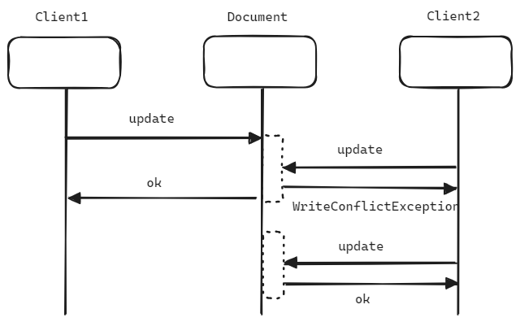

## MongoDB Features

## Mongo DB

MongoDB 는 오픈소스 NoSQL 데이터베이스입니다. 2007 년 10gen 이라는 회사에서 Paas 로 MongoDB 개발을 시작했고, 2009 년에 오픈소스 모델로 전환해서 사용지원, 기타 서비스를 제공하는 방식을 따르게 되었습니다. 2013년에는 10gen 이라는 회사 명이 MongoDB Inc. 로 변경되었으며 현재 전 세계에서 대중적으로 알려진 NoSQL 데이터베이스가 되었습니다. 

스키마가 정의되어 있지 않아도 데이터 저장을 유연하게 할 수 있습니다. 또한 다양한 종류의 index를 지원하고, 4.0 부터 multi docoument transaction 을 지원하기에 트랜잭션의 ACID 가 보장됩니다. 

몽고DB를 운영할 때 레플리카셋과 샤드 클러스터를 적용하면 데이터를 여러 노드에 분산해서 저장하고 처리하는 것이 가능해지며, 장애에 내성이 강한 데이터베이스로 전환이 가능합니다. 

 

## MongoDB BSON

Binary 형식의 JSON 데이터를 BSON 이라고 부릅니다. MongoDB는 데이터를 BSON 형식으로 저장합니다. 

BSON 은 JSON 보다 인코딩/디코딩이 빠르고, 다양한 데이터 타입들이 BSON 에 지원됩니다. 

- document id : ObjectId
- 바이너리 데이터 : BinData
- 날짜 : Date, ISODate
- 정규표현식

 

BSON 타입에 대한 자세한 내용은 아래의 링크들에서 자세히 확인 가능합니다. 

bsonspec.org

- [bsonspec.org](https://bsonspec.org/)
- [bsonspec.org/implementation.html](https://bsonspec.org/implementations.html)

Mongodb.com

- [What is BSON?](https://www.mongodb.com/basics/bson#what-is-bson)
- [How is BSON different from JSON?](https://www.mongodb.com/basics/bson#how-is-bson-different-from-json)
- [Advantages of BSON](https://www.mongodb.com/basics/bson#advantages-of-bson-)
- [How to convert JSON to BSON](https://www.mongodb.com/basics/bson#how-to-convert-json-to-bson)
- [Import and export BSON documents](https://www.mongodb.com/basics/bson#how-to-import-and-export-a-bson-file-in-mongodb)
- [BSON Document Example](https://www.mongodb.com/basics/bson#bson-example-how-bson-is-stored-in-mongodb-database)

 

## MongoDB BSON 인코딩

BSON 은 필드의 순서에 따라서 인코딩이 달라지며, 첫줄은 document 의 크기를 의미합니다. 

> bson converter 는 [https://onlinejsontools.com/convert-json-to-bson](https://onlinejsontools.com/convert-json-to-bson) 을 사용했습니다.

- 

 

## MongoDB Document, Collection, Database

> TODO : 그림 추가 

## MongoDB 트랜잭션

4.0 버전 이후부터는 multi-document 트랜잭션 ACID 를 지원하기 시작했습니다. 

레플리카셋과 샤드클러스터가 적용된 MongoDB 환경에서 트랜잭션 사용 시 쿼리가 브로드캐스트 되는데, 이 경우 성능에 일정 부분은 영향을 줄 수 있다는 점을 감안해야 합니다. 

RDBMS 에서도 트랜잭션 자체가 길면 데이터 처리의 지연이 발생하며, 이런 부분에 대해서 트랜잭션을 짧게 구성하는 등의 처리를 하기에 트랜잭션에 대해서는 RDBMS, MongoDB 모두 트레이드 오프가 있다는 점을 감안할 수 있을 듯 합니다. 

