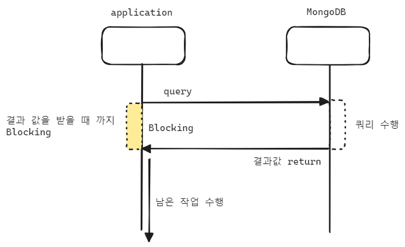
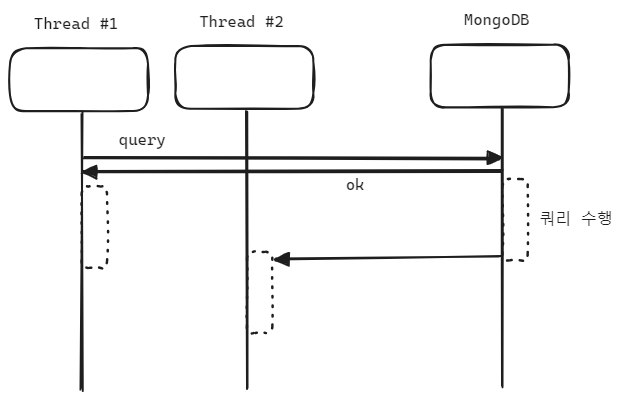
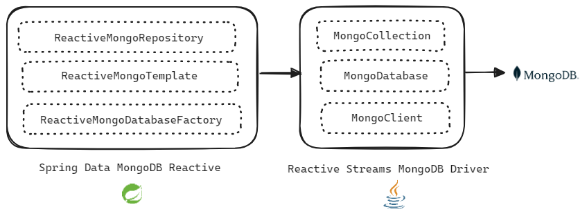
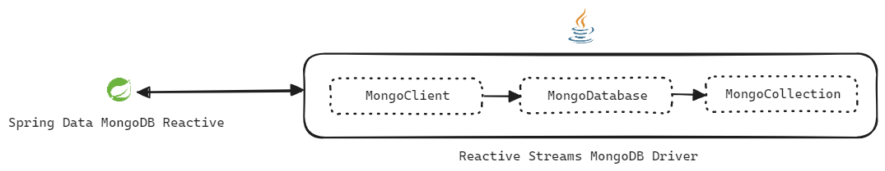

## MongoDB Reactive Streams Driver

## 참고자료

- [Github | mongo-java-driver-reactivestreams](https://github.com/mongodb/mongo-java-driver-reactivestreams/tree/master)

- [MongoDB Reactive Streams Java Driver](https://mongodb.github.io/mongo-java-driver-reactivestreams/)
- [MongoDB Reactive Streams Documentation](https://mongodb.github.io/mongo-java-driver/5.0/driver-reactive/)
- [mongodb.com/docs/drivers/reactive-streams](https://www.mongodb.com/docs/drivers/reactive-streams/)
  - [Reference Documentation](https://mongodb.github.io/mongo-java-driver/5.0)
  - [Source Code](https://github.com/mongodb/mongo-java-driver/tree/master/driver-reactive-streams/)
  - [API Documentation](https://mongodb.github.io/mongo-java-driver/5.0/apidocs/mongodb-driver-reactivestreams/)
  - [Tutorials](https://mongodb.github.io/mongo-java-driver/5.0/driver-reactive/tutorials/)
- mongodb.github.io/mongodb-java-driver 
  - 공식 도큐먼테이션 페이지이며, 버전명을 클릭해서 넘어가는 문서 페이지에서 Reactive Streams Driver 에 대한 설명을 모두 다루고 있습니다.
  - [MongoDB Reactive Streams Driver Documentation](https://mongodb.github.io/mongo-java-driver/5.0/driver-reactive/)
  - [MongoDB Reactive Streams Driver Quick Start](https://mongodb.github.io/mongo-java-driver/5.0/driver-reactive/getting-started/quick-start/)

<br/>


## MongoDB Driver
Java 언어를 사용할 때 지원되는 MongoDB Driver 는 아래와 같이 두 종류가 있습니다. 

> 참고 : [MongoDB Java Drivers](https://www.mongodb.com/docs/drivers/java-drivers/)

-  [Java Driver](https://www.mongodb.com/docs/drivers/java/sync/current) : Synchronous 하게 동작하는 Mongo Driver
- [Reactive Streams Driver](https://www.mongodb.com/docs/drivers/reactive-streams/) : 비동기 스트림 프로세싱을 지원하는 Reactive Streams API 기반의 Driver

<br/>


### Java Driver (Synchronous Driver)



결과값을 확인해야 다음 연산이 이뤄지는 Synchronous API 이며, Blocking 기반의 IO 연산방식의 Driver 입니다. 클라이언트측에서 요청을 했을 때 결과값을 받기 전 까지는 Blocking 이 발생합니다.<br/>

<br/>


### Reactive Streams Driver



<br/>

Reactive Streams Driver 는 논블로킹 방식의 비동기 연산으로 동작합니다. Spring Reactive Stack 내에서 사용되며, 높은 성능, 안정성을 제공합니다.<br/>

<br/>


### Spring Data MongoDB 와 Reactive Streams Driver



Spring Data MongoDB Reactive 라이브러리에는 아래와 같은 Database 접근 요소들이 있습니다.

- [ReactiveMongoRepository](https://docs.spring.io/spring-data/mongodb/docs/current/api/org/springframework/data/mongodb/repository/ReactiveMongoRepository.html)
- [ReactiveMongoTemplate](https://docs.spring.io/spring-data/mongodb/docs/current/api/org/springframework/data/mongodb/core/ReactiveMongoTemplate.html)
- [ReactiveMongoDatabaseFactory](https://docs.spring.io/spring-data/mongodb/docs/current/api/org/springframework/data/mongodb/ReactiveMongoDatabaseFactory.html)

<br/>


그리고 Spring Data MongoDB Reactive 라이브러리들은 아래의 Driver 기반의 코드들을 한단계 감싸서 고수준으로 제공하는 것입니다. 아주 드물게 복잡한 쿼리나 이런 것들을 작성해야 할 경우 아래와 같은 MongoClient, MongoDatabase, MongoCollection 기반으로 작성하기도 합니다.<br/>

- [MongoCollection](https://mongodb.github.io/mongo-java-driver/4.0/apidocs/mongodb-driver-reactivestreams/com/mongodb/reactivestreams/client/MongoCollection)
- [MongoDatabase](https://mongodb.github.io/mongo-java-driver/4.0/apidocs/mongodb-driver-reactivestreams/com/mongodb/reactivestreams/client/MongoDatabase.html)
- [MongoClient](https://mongodb.github.io/mongo-java-driver/4.0/apidocs/mongodb-driver-reactivestreams/com/mongodb/reactivestreams/client/MongoClient.html)

<br/>


## Reactive Streams Driver

Spring Data MongoDB Reactive 는 Reactive Streams Driver 의 API 를 감싸고 있는 고수준 API 입니다.




Spring Data MongoDB Reactive 에서 Reactive Streams MongoDB Driver 를 이용해서 대표적으로 3 계층으로 나눠서 상호작용을 합니다.


MongoClient

- MongoDB 클러스터를 가리키는 객체이며, 커넥션 객체들을 생성하거나 바인딩하고 있는 역할을 합니다.
- 흔히 이야기하는 접속객체 같은 역할과 MongoDatabse Factory 역할을 합니다.

MongoDatabase

- MongoDB 의 Database 를 가리키는 역할을 합니다.
- codec, write concern, read preference 등과 같은 정보들을 바인딩하고 있습니다.
- MongoClient 객체를 통해서 MongoDatabase 객체를 얻어올 수 있습니다.

MongoCollection

- MongoDB 의 collection 을 얻어오고 바인딩하고 있는 객체입니다.
- MongoDatabase 객체를 통해서 MongoCollection 객체를 얻어올 수 있습니다.

<br/>


마지막으로 위의 그림에는 없는 MongoClients 라는 클래스가 하나 더 있습니다.<br/>

MongoClients 클래스는 MongoClient 라는 Mongodb 접속을 위한 MongoClient 객체를 만드는 MongoClient Factory 역할을 하는 클래스입니다. 그리고 이렇게 MongoClients 클래스를 통해 생성된 MongoClient 객체는 Connection 에 대한 정보들을 담고 있습니다.<br/>

<br/>


### e.g. Connection 생성 

> 참고자료 : [MongoDB Reactive Streams Driver Quick Start](https://mongodb.github.io/mongo-java-driver/5.0/driver-reactive/getting-started/quick-start/)

먼저 단순한 버전의 예제입니다.

```java
package io.chagchagchag.example_mongo.mongodb_reactive_example.examples;

import com.mongodb.reactivestreams.client.MongoClient;
import com.mongodb.reactivestreams.client.MongoClients;
import com.mongodb.reactivestreams.client.MongoCollection;
import com.mongodb.reactivestreams.client.MongoDatabase;
import lombok.extern.slf4j.Slf4j;
import org.bson.Document;

@Slf4j
public class MongoClientExample {
  public static void main(String[] args) {
    MongoClient mongoClient = MongoClients.create(
        "mongodb+srv://[계정명]:[비밀번호]@[Mongo Cloud 접속 주소]/"
    );

    MongoDatabase helloworld = mongoClient.getDatabase("helloworld");
    log.info("database == {} ", helloworld.getName());
    MongoCollection<Document> book = helloworld.getCollection("book");
    log.info("collection = {} ", book.getNamespace().getCollectionName());

    log.info("Bye Bye. Close ~!!!");
    mongoClient.close();
  }
}
```

위에서 설명했던 MongoClients 클래스를 통해 MongoClient 객체를 생성합니다. 그리고 얻어낸 `mongoClient` 객체로 database 명을 얻어오고, collection 을 얻어와서 컬렉션 명을 출력하고 있습니다. 접속 주소에는 컬렉션 명과, 데이터베이스 명을 지정하지 않았는데도 잘 읽어오는 것을 보면, MongoClient 는 내부적으로 접속을 위한 통신작업을 한다는 것을 알 수 있습니다.<br/>

<br/>


출력

```plain
// ...

19:28:56.824 [main] INFO io...MongoClientExample -- database == helloworld 
19:28:56.828 [main] INFO io...MongoClientExample -- collection = book 
19:28:56.828 [main] INFO io...MongoClientExample -- Bye Bye. Close ~!!!
```

<br/>


이번에는 조금 복잡한 버전의 예제입니다.

```java
package io.chagchagchag.example_mongo.mongodb_reactive_example.examples;

import com.mongodb.ConnectionString;
import com.mongodb.MongoClientSettings;
import com.mongodb.reactivestreams.client.MongoClient;
import com.mongodb.reactivestreams.client.MongoClients;
import lombok.extern.slf4j.Slf4j;

@Slf4j
public class MongoClientExample2 {
  public static void main(String[] args) {
    var connection = new ConnectionString(
        "mongodb+srv://[계정명]:[비밀번호]@[Mongo Cloud 접속 주소]/"
    );

    MongoClientSettings mongoClientSettings = MongoClientSettings.builder()
        .applyConnectionString(connection)
        .build();

    try(MongoClient mongoClient = MongoClients.create(mongoClientSettings)){
      var database = mongoClient.getDatabase("helloworld");
      log.info("database : {}", database.getName());

      var collection = database.getCollection("book");
      log.info("collection : {}", collection.getNamespace().getCollectionName());

      log.info("Finish. Bye Bye~!!");
    }

  }
}
```

내용은 위의 예제와 비슷하므로 설명은 생략하도록 하겠습니다.<br/>


출력

```plain
// ...

19:36:06.295 [main] INFO io...MongoClientExample2 -- database : helloworld
19:36:06.301 [main] INFO io...MongoClientExample2 -- collection : book
19:36:06.301 [main] INFO io...MongoClientExample2 -- Finish. Bye Bye~!!
```

<br/>


### MongoCollection

### Document

### BSON, BSON Codec


