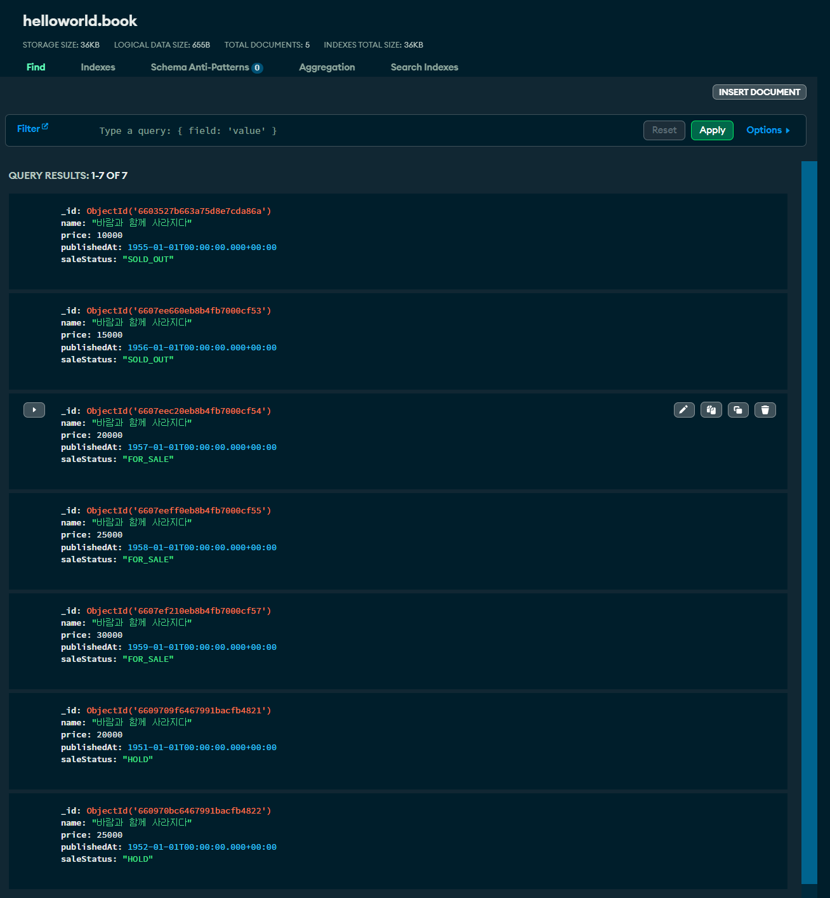
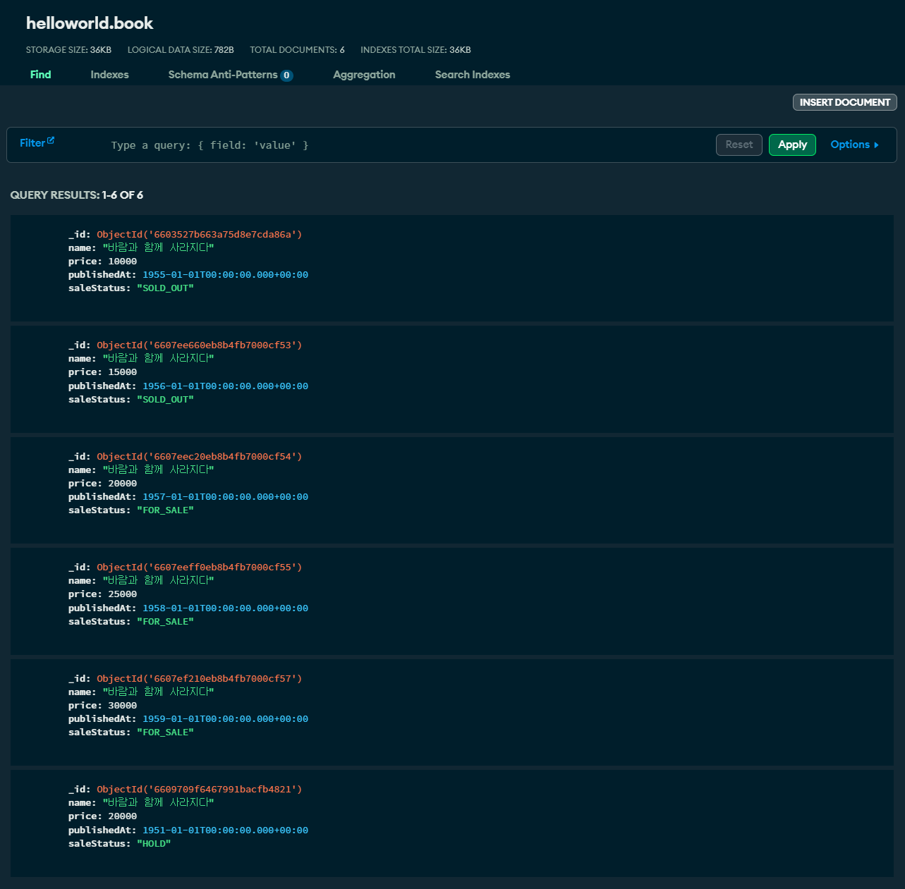
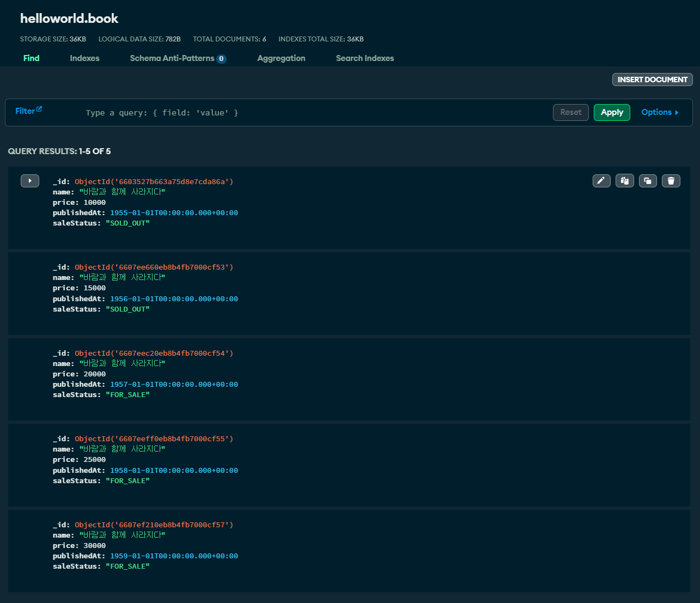

## Query Method

쿼리 메서드는 JPA 에서 지원하는 쿼리메서드 처럼 동작합니디.<br/>

Spring Data MongoDB Reactive 기반으로 Query Method 를 구현할 때에는 ReactiveMongoRepository, ReactiveSortingRepository 와 같은 Repository interface 들을 상속받아서 구현합니다.<br/>

예를 들면 아래와 같은 모습입니다.

```java
package io.chagchagchag.example_mongo.mongodb_reactive_example.examples.book;

import java.math.BigDecimal;
import org.bson.types.ObjectId;
import org.reactivestreams.Publisher;
import org.springframework.data.mongodb.repository.Aggregation;
import org.springframework.data.mongodb.repository.Query;
import org.springframework.data.mongodb.repository.Update;
import org.springframework.data.repository.reactive.ReactiveSortingRepository;
import reactor.core.publisher.Flux;
import reactor.core.publisher.Mono;

public interface BookDocumentRepository extends ReactiveSortingRepository<BookDocument, ObjectId> {
  Flux<BookDocument> findAllByName(Publisher<String> name);

  Mono<BookNameDocument> findFirstByName(String name);

  Mono<Long> deleteByName(String name);

  Mono<BookDocument> deleteByPriceGreaterThan(BigDecimal price);

  @Query("{'name': ?0}")
  Flux<BookDocument> findAllByName(String name);

  @Query("{_id:  $0}")
  @Update(value = "{$set:  {name: ?1}}")
  Mono<Integer> updateNameById(String id, String name);
}
```

<br/>

ReactiveMongoRepository, ReactiveSortingRepository 등과 같은 Repository 관련 interface 들은 Spring Data MongoDB Reactive 에서는 아래와 같은 상속 구조로 정의되어 있습니다.


<br/>


이번 문서에서는 주요 쿼리들을 작성하고 출력결과는 어떻게 되는지 살펴봅니다. testcontainer 를 사용할 수도 있겠지만 환경설정 과정을 정리하는데에 시간이 많이 걸리기에 비교적 간단한 방법으로 문서를 작성하기로 했고, 따라서  원격지에 저장된 데이터를 기준으로 쿼리를 수행했을 때의 출력결과만 표시하는 방식으로 문서를 정리합니다.<br/>

<br/>


## 예제 데이터

이번 예제에서 사용할 샘플 데이터는 아래와 같습니다. helloworld 라는 데이터베이스가 있고 이 데이터베이스 안의 `book` 이라는 컬렉션을 예제로 사용합니다. 그리고 데이터를 자세히 보면, "바람과 함께 사라지다" 라는 책이 다양한 종류로 존재하며 가격은 10000, 15000, 20000, 25000, 30000 원대가 있으며, 판매 상태는 `SOLD_OUT`, `FOR_SALE`, `HOLD` 가 존재함을 알 수 있습니다.<br/>



<br/>


## find 연산들

### e.g. 1 : 가격이 가장 높은 책을 조회

```java
package io.chagchagchag.example_mongo.mongodb_reactive_example.examples.book.find;

// ...

@SpringBootTest
public class BookDocumentFindTest {
  private final Logger log = LoggerFactory.getLogger(BookDocumentFindTest.class);

  @Autowired
  private BookDocumentRepository bookDocumentRepository;

  @DisplayName("TEST_FIND_QUERY__가격이_가장_높은_책을_조회")
  @Test
  public void TEST_FIND_QUERY__가격이_가장_높은_책을_조회(){
    // given

    // when
    BookDocument book = bookDocumentRepository
        .findFirstByNameOrderByPriceDesc("바람과 함께 사라지다")
        .block();

    // then
    log.info("book.name = " + book.getName());
    log.info("book.price = " + book.getPrice());
    log.info("book.saleStatus = " + book.getSaleStatus());
  }

}
```

<br/>


출력결과

```plain
2024-03-31T20:42:31.045+09:00  INFO 634464 --- [main] i.c.e.m.e.b.find.BookDocumentFindTest    : book.name = 바람과 함께 사라지다
2024-03-31T20:42:31.045+09:00  INFO 634464 --- [main] i.c.e.m.e.b.find.BookDocumentFindTest    : book.price = 30000
2024-03-31T20:42:31.045+09:00  INFO 634464 --- [main] i.c.e.m.e.b.find.BookDocumentFindTest    : book.saleStatus = FOR_SALE
```

<br/>


### e.g. 2 : 객체 프로젝션 테스트

도큐먼트에서 원하는 필드만 조회해오는 예제입니다.

```java
package io.chagchagchag.example_mongo.mongodb_reactive_example.examples.book.find;

import io.chagchagchag.example_mongo.mongodb_reactive_example.examples.book.BookDocument;
import io.chagchagchag.example_mongo.mongodb_reactive_example.examples.book.BookDocumentRepository;
import io.chagchagchag.example_mongo.mongodb_reactive_example.examples.book.BookNameDocument;
import org.junit.jupiter.api.DisplayName;
import org.junit.jupiter.api.Test;
import org.slf4j.Logger;
import org.slf4j.LoggerFactory;
import org.springframework.beans.factory.annotation.Autowired;
import org.springframework.boot.test.context.SpringBootTest;
import reactor.core.publisher.Mono;

@SpringBootTest
public class BookDocumentFindTest {
  private final Logger log = LoggerFactory.getLogger(BookDocumentFindTest.class);

  @Autowired
  private BookDocumentRepository bookDocumentRepository;
  
  // ...

  @DisplayName("FIND_QUERY__프로젝션_테스트_가장_최근에_발간된_책을_1건_조회")
  @Test
  public void TEST_FIND_QUERY__프로젝션_테스트_가장_최근에_발간된_책을_1건_조회(){
    // given

    // when
    BookNameDocument bookName = bookDocumentRepository
        .findFirstByNameOrderByPublishedAtDesc("바람과 함께 사라지다")
        .block();

    // then
    log.info("book.name = " + bookName.getName());
  }

}
```

<br/>


출력결과

```plain
2024-03-31T22:18:57.051+09:00  INFO 1082904 --- [main] i.c.e.m.e.b.find.BookDocumentFindTest    : book.name = 바람과 함께 사라지다

Process finished with exit code 0
```

<br/>


## delete 연산들

delete 연산의 쿼리 메서드는 아래의 규칙을 따릅니다.

- 반환형을 Flux\<T\> 로 선언한 경우 : 삭제한 document 데이터의 시퀀스를 반환
- 반환형을 Mono\<T\> 으로 선언한 경우 : 삭제한 document 를 반환
- 반환형을 Mono\<Long\> 으로 선언한 경우 : 삭제한 document 들의 개수를 반환

<br/>


### e.g. 1: SaleStatus 가 `HOLD` 이면서, 23999 원 이상인 책을 삭제

```java
package io.chagchagchag.example_mongo.mongodb_reactive_example.examples.book.find;

import io.chagchagchag.example_mongo.mongodb_reactive_example.examples.book.BookDocument;
import io.chagchagchag.example_mongo.mongodb_reactive_example.examples.book.BookDocumentRepository;
import io.chagchagchag.example_mongo.mongodb_reactive_example.examples.book.BookNameDocument;
import io.chagchagchag.example_mongo.mongodb_reactive_example.examples.book.SaleStatus;
import java.math.BigDecimal;
import java.util.List;
import java.util.stream.Collectors;
import org.junit.jupiter.api.DisplayName;
import org.junit.jupiter.api.Test;
import org.slf4j.Logger;
import org.slf4j.LoggerFactory;
import org.springframework.beans.factory.annotation.Autowired;
import org.springframework.boot.test.context.SpringBootTest;
import reactor.core.publisher.Flux;
import reactor.core.publisher.Mono;

@SpringBootTest
public class BookDocumentFindTest {
  private final Logger log = LoggerFactory.getLogger(BookDocumentFindTest.class);

  @Autowired
  private BookDocumentRepository bookDocumentRepository;

  // ... 
  
  @DisplayName("DELETE_QUERY__DELETE_테스트_SALE_STATUS_가_HOLD_이면서_가격이_23999원_이상의_책을_삭제")
  @Test
  public void TEST_DELETE_QUERY__DELETE_테스트_SALE_STATUS_가_HOLD_이면서_가격이_23999원_이상의_책을_삭제(){
    // given

    // when
    List<BookDocument> deletedBookList = bookDocumentRepository
        .deleteBySaleStatusAndPriceGreaterThan(SaleStatus.HOLD, BigDecimal.valueOf(23999))
        .toStream()
        .collect(Collectors.toList());

    // then
    log.info(">>> deleted book list ...");
    deletedBookList.stream()
        .forEach(bookDocument -> {
          log.info("book.name = {}, book.price = {}", bookDocument.getName(), bookDocument.getPrice());
        });
  }
}
```

<br/>


출력결과

```plain
2024-03-31T23:31:56.619+09:00  INFO 161352 --- [main] i.c.e.m.e.b.find.BookDocumentFindTest    : >>> deleted book list ...
2024-03-31T23:31:56.619+09:00  INFO 161352 --- [main] i.c.e.m.e.b.find.BookDocumentFindTest    : book.name = 바람과 함께 사라지다, book.price = 25000
```

<br/>


### e.g. 2: SaleStatus 가 `HOLD` 인 모든 책을 삭제

위에서 이미 SaleStatus 가 HOLD 인 책중 23999 원 이상인 책을 삭제했기 때문에, 현재 SaleStatus 가 `HOLD` 인 책은 1개만 남아있는 상태입니다.<br/>



이번에는 SaleStatus 가 `HOLD` 인 모든 데이터를 삭제하는 Query Method 를 테스트해봅니다.

```java
package io.chagchagchag.example_mongo.mongodb_reactive_example.examples.book.find;

import io.chagchagchag.example_mongo.mongodb_reactive_example.examples.book.BookDocument;
import io.chagchagchag.example_mongo.mongodb_reactive_example.examples.book.BookDocumentRepository;
import io.chagchagchag.example_mongo.mongodb_reactive_example.examples.book.BookNameDocument;
import io.chagchagchag.example_mongo.mongodb_reactive_example.examples.book.SaleStatus;
import java.math.BigDecimal;
import java.util.List;
import java.util.stream.Collectors;
import org.junit.jupiter.api.DisplayName;
import org.junit.jupiter.api.Test;
import org.slf4j.Logger;
import org.slf4j.LoggerFactory;
import org.springframework.beans.factory.annotation.Autowired;
import org.springframework.boot.test.context.SpringBootTest;
import reactor.core.publisher.Flux;
import reactor.core.publisher.Mono;

@SpringBootTest
public class BookDocumentFindTest {
  private final Logger log = LoggerFactory.getLogger(BookDocumentFindTest.class);

  @Autowired
  private BookDocumentRepository bookDocumentRepository;

  // ...
  
  @DisplayName("DELETE_QUERY__DELETE_테스트_SALE_STATUS_가_HOLD_인_모든_도큐먼트_삭제")
  @Test
  public void TEST_DELETE_QUERY__DELETE_테스트_SALE_STATUS_가_HOLD_인_모든_도큐먼트_삭제(){
    // given
    
    // when
    BookDocument deleted = bookDocumentRepository
        .deleteBySaleStatus(SaleStatus.HOLD)
        .block();

    // then
    log.info(">>> deleted book");
    log.info(
        "deleted book.name = {}, book.price = {}, book.saleStatus = {}",
        deleted.getName(), deleted.getPrice(), deleted.getSaleStatus()
    );
  }
  
}
```

<br/>


출력결과

```plain
2024-03-31T23:41:45.278+09:00  INFO 214168 --- [main] i.c.e.m.e.b.find.BookDocumentFindTest    : >>> deleted book
2024-03-31T23:41:45.279+09:00  INFO 214168 --- [main] i.c.e.m.e.b.find.BookDocumentFindTest    : deleted book.name = 바람과 함께 사라지다, book.price = 20000, book.saleStatus = HOLD

Process finished with exit code 0
```

<br/>


데이터 결과를 보면 아래와 같이 `HOLD` 인 데이터들이 모두 삭제되어 있습니다.



<br/>


## Aggregation

Aggregation 은 별도의 문서에 정리합니다.


