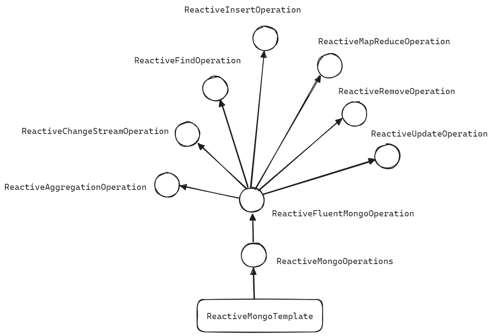

## ReactiveMongoOperation

MongoReactiveMongoTemplate 은 ReactiveMongoOperation 을 implements 합니다. ReactiveMongoOperation 에는 다양한 operation 들을 지원하며 굉장히 유용한 쿼리 함수들이 지원됩니다.<br/>

ReactiveMongoOperation 은 ReactiveFluentMongoOperation 이라는 interface 를 상속(extends) 하고 있는데, 이 ReactiveFluentMongoOperation 은 아래와 같이 굉장히 다양한 종류의 Operation 들을 extends 하고 있습니다.

- ReactiveAggregationOperation
- ReactiveChangeStreamOperation
- ReactiveFindOperation
- ReactiveInsertOperation
- ReactiveMapReduceOperation
- ReactiveRemoveOperation
- ReactiveUpdateOperation




<br/>


ReactiveMongoOperations 는 이 ReactiveFluentMongoOperation interface 에서 제공하는 다양한 연산 쿼리들을 이용해서 다양한 쿼리를 수행하는 단축형의 메서드 들을 제공합니다. 그중 일부의 코드를 발췌해 요약해보면 아래와 같습니다.<br/>

> 출처 : [ReactiveMongoOperations.java](https://github.com/spring-projects/spring-data-mongodb/blob/main/spring-data-mongodb/src/main/java/org/springframework/data/mongodb/core/ReactiveMongoOperations.java)

```java
package org.springframework.data.mongodb.core;
// ...

public interface ReactiveMongoOperations extends ReactiveFluentMongoOperations {
    <T> Flux<T> findAll(Class<T> entityClass);
	<T> Flux<T> findAll(Class<T> entityClass, String collectionName);
	
    <T> Mono<T> findOne(Query query, Class<T> entityClass);
	<T> Mono<T> findOne(Query query, Class<T> entityClass, String collectionName);
	
    Mono<Boolean> exists(Query query, String collectionName);
	Mono<Boolean> exists(Query query, Class<?> entityClass);
	Mono<Boolean> exists(Query query, @Nullable Class<?> entityClass, String collectionName);
	
    <T> Flux<T> find(Query query, Class<T> entityClass);
	<T> Flux<T> find(Query query, Class<T> entityClass, String collectionName);
	
    <T> Mono<Window<T>> scroll(Query query, Class<T> entityType);
	<T> Mono<Window<T>> scroll(Query query, Class<T> entityType, String collectionName);
	
    <T> Mono<T> findById(Object id, Class<T> entityClass);
	<T> Mono<T> findById(Object id, Class<T> entityClass, String collectionName);
	
    default <T> Flux<T> findDistinct(String field, Class<?> entityClass, Class<T> resultClass) {
		return findDistinct(new Query(), field, entityClass, resultClass);
	}
    
    
    <O> Flux<O> aggregate(TypedAggregation<?> aggregation, String collectionName, Class<O> outputType);
    <O> Flux<O> aggregate(TypedAggregation<?> aggregation, Class<O> outputType);
	<O> Flux<O> aggregate(Aggregation aggregation, Class<?> inputType, Class<O> outputType);
	<O> Flux<O> aggregate(Aggregation aggregation, String collectionName, Class<O> outputType);
    
    
	<T> Mono<T> findAndModify(Query query, UpdateDefinition update, Class<T> entityClass);
	<T> Mono<T> findAndModify(Query query, UpdateDefinition update, Class<T> entityClass, String collectionName);
	<T> Mono<T> findAndModify(Query query, UpdateDefinition update, FindAndModifyOptions options, Class<T> entityClass);
	<T> Mono<T> findAndModify(Query query, UpdateDefinition update, FindAndModifyOptions options, Class<T> entityClass,
			String collectionName);

    // ...
    
	<S, T> Mono<T> findAndReplace(Query query, S replacement, FindAndReplaceOptions options, Class<S> entityType,
			String collectionName, Class<T> resultType);
    
    // ...
    
	<T> Mono<T> findAndRemove(Query query, Class<T> entityClass);
	<T> Mono<T> findAndRemove(Query query, Class<T> entityClass, String collectionName);
    
	Mono<Long> count(Query query, Class<?> entityClass);
	Mono<Long> count(Query query, String collectionName);
	Mono<Long> count(Query query, @Nullable Class<?> entityClass, String collectionName);

    
	Mono<Long> estimatedCount(String collectionName);
    // ...
}
```

<br/>


## ReactiveFluentMongoOperations

ReactiveFluentMongoOperation 은 아래와 같이 굉장히 다양한 종류의 Operation 들을 extends 하고 있습니다.

- ReactiveAggregationOperation
- ReactiveChangeStreamOperation
- ReactiveFindOperation
- ReactiveInsertOperation
- ReactiveMapReduceOperation
- ReactiveRemoveOperation
- ReactiveUpdateOperation


<br/>


### ReactiveInsertOperation

> TODO : 다른 작업 완료 후 작업 예정

### ReactiveFindOperation

> TODO : 다른 작업 완료 후 작업 예정

### ReactiveUpdateOperation

> TODO : 다른 작업 완료 후 작업 예정

### ReactiveRemoveOperation

> TODO : 다른 작업 완료 후 작업 예정

### ReactiveAggregationOperation

> TODO : 다른 작업 완료 후 작업 예정

### ReactiveChangeStreamOperation

> TODO : 다른 작업 완료 후 작업 예정

