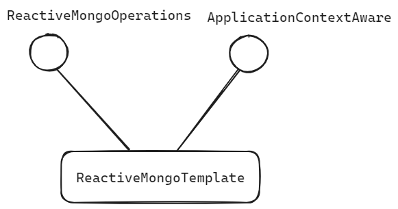
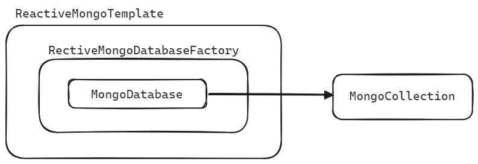

## ReactiveMongoTemplate

ReactiveMongoTemplate 은 ReactiveMongoOperations, ApplicationContextAware 를 implements 하는 클래스입니다.




<br/>

ReactiveMongoTemplate 은 MongoConverter, ReactiveMongoDatabaseFactory 를 결합해서 하나의 ReactiveMongoTemplate 객체를 생성하는 방식으로 객체를 생성해서 @Bean 으로 등록하는 경우가 많습니다. <br/>

보통 ReactiveMongoTemplate 을 사용하면 MongoDB의 쿼리들을 BSON 형태로 굉장히 다양하게 제공되는 유용한 쿼리를 할수 있고 PojoCodec, CustomCodec 등을 등록하지 않더라도 메소드 체이닝을 통해서 결과값을 Entity 형태로 돌려받을 수 있습니다.<br/>

ReactiveMongoTemplate 은 쿼리를 통해서 내부적으로 데이터를 변환해서 리턴하려면 ReactiveMongoTemplate 내부에서 MongoCollection 에 접근을 하게 됩니다. 이때 [ReactiveMongoDatabaseFactory](ReactiveMongoDatabaseFactory) 객체의 getMongoDatabase() 를 통해서 MongoDatabase 를 얻어오고 MongoCollection 에 접근하게 됩니다.<br/>


ReactiveMongoOperations 는 굉장히 다양한 연산들을 지원하는 interface 이며, 다음 문서에서 ReactiveMongoOperations 에 대해 자세히 정리합니다.<br/>

<br/>


## 생성자

> 참고 : [ReactiveMongoTemplate.java](https://github.com/spring-projects/spring-data-mongodb/blob/main/spring-data-mongodb/src/main/java/org/springframework/data/mongodb/core/ReactiveMongoTemplate.java)

ReactiveMongoTemplate 의 생성자는 아래와 같이 4 종류가 있습니다.

```java
package org.springframework.data.mongodb.core;

// ...

public class ReactiveMongoTemplate implements ReactiveMongoOperations, ApplicationContextAware {
    public ReactiveMongoTemplate(MongoClient mongoClient, String databaseName) {
		// ...
	}
    
    public ReactiveMongoTemplate(ReactiveMongoDatabaseFactory mongoDatabaseFactory) {
		// ...
	}
    
    public ReactiveMongoTemplate(ReactiveMongoDatabaseFactory mongoDatabaseFactory,
			@Nullable MongoConverter mongoConverter) {
		// ...
	}
    
    public ReactiveMongoTemplate(ReactiveMongoDatabaseFactory mongoDatabaseFactory,
			@Nullable MongoConverter mongoConverter, Consumer<Throwable> subscriptionExceptionHandler) {
        // ...
    }
}
```

첫번째 생성자인 `ReactiveMongoTemplate(MongoClient mongoClient, String databaseName)` 을 사용하면 단순한 ReactiveMongoTemplate  객체를 생성하는 것이 가능합니다.<br/>

일반적으로는 두번째 또는 세번째 생성자처럼 ReactiveMongoDatabaseFactory 또는 MongoConverter 를 받아서 ReactiveMongoTemplate 을 생성해서 @Bean 으로 등록하는 경우가 많습니다.<br/>

<br/>


## Configuration

간단한 ReactiveMongoTemplate 을 설정 코드는 아래와 같습니다. 설명은 생략하겠습니다.<br/>

```java
package io.chagchagchag.example_mongo.mongodb_reactive_example.examples.config;

import com.mongodb.reactivestreams.client.MongoClient;
import com.mongodb.reactivestreams.client.MongoClients;
import org.springframework.beans.factory.annotation.Value;
import org.springframework.boot.autoconfigure.mongo.MongoProperties;
import org.springframework.context.annotation.Bean;
import org.springframework.context.annotation.Configuration;
import org.springframework.data.mongodb.ReactiveMongoDatabaseFactory;
import org.springframework.data.mongodb.ReactiveMongoTransactionManager;
import org.springframework.data.mongodb.core.ReactiveMongoTemplate;
import org.springframework.data.mongodb.core.SimpleReactiveMongoDatabaseFactory;
import org.springframework.data.mongodb.core.convert.MongoConverter;

@Configuration
public class MongoReactiveConfiguration {
  @Value("${spring.data.mongodb.uri}")
  private String mongoUri;

  @Bean
  public MongoClient reactiveMongoClient(){
    return MongoClients.create(mongoUri);
  }

  @Bean
  public ReactiveMongoTransactionManager transactionManager(
      ReactiveMongoDatabaseFactory dbFactory
  ){
    return new ReactiveMongoTransactionManager(dbFactory);
  }

  @Bean(name = "bookReactiveMongoDatabaseFactory")
  public SimpleReactiveMongoDatabaseFactory bookReactiveMongoDatabaseFactory(
      MongoProperties mongoProperties,
      MongoClient mongoClient
  ){
    // 이렇게 할 수도 있지만, 하나의 프로젝트에서 여러 몽고 database 를 사용할 수 있으므로 비활성화
//    String database = mongoProperties.getMongoClientDatabase();
    final String database = "book";
    return new SimpleReactiveMongoDatabaseFactory(mongoClient, database);
  }

  @Bean(name = "bookReactiveMongoTemplate")
  public ReactiveMongoTemplate bookReactiveMongoTemplate(
      ReactiveMongoDatabaseFactory bookReactiveMongoDatabaseFactory,
      MongoConverter mongoConverter
  ){
    return new ReactiveMongoTemplate(bookReactiveMongoDatabaseFactory, mongoConverter);
  }
}
```

<br/>


이렇게 생성한 MongoTemplate 은 어떤 MongoTemplate 을 사용할지 아래와 같이 `@EnableReactiveMongoRepositories` 에 명시해줘야 합니다.

```java
package io.chagchagchag.example_mongo.mongodb_reactive_example;

import org.springframework.boot.SpringApplication;
import org.springframework.boot.autoconfigure.SpringBootApplication;
import org.springframework.data.mongodb.repository.config.EnableReactiveMongoRepositories;

@EnableReactiveMongoRepositories(
		basePackages = {
				"io.chagchagchag.example_mongo.mongodb_reactive_example.examples.book",
		},
		reactiveMongoTemplateRef = "bookReactiveMongoTemplate"
)
@SpringBootApplication
public class MongodbReactiveExampleApplication {

	public static void main(String[] args) {
		SpringApplication.run(MongodbReactiveExampleApplication.class, args);
	}

}
```

<br/>


## ReactiveMongoDatabaseFactory

> 참고 : [ReactiveMongoDatabaseFactory](https://github.com/spring-projects/spring-data-mongodb/blob/main/spring-data-mongodb/src/main/java/org/springframework/data/mongodb/ReactiveMongoDatabaseFactory.java)

ReactiveMongoDatabaseFactory 의 코드는 아래와 같습니다. 자세한 코드는 [ReactiveMongoDatabaseFactory](https://github.com/spring-projects/spring-data-mongodb/blob/main/spring-data-mongodb/src/main/java/org/springframework/data/mongodb/ReactiveMongoDatabaseFactory.java) 를 참고해주시기 바랍니다.

```java
package org.springframework.data.mongodb;
public interface ReactiveMongoDatabaseFactory extends CodecRegistryProvider {
    Mono<MongoDatabase> getMongoDatabase() throws DataAccessException;
	Mono<MongoDatabase> getMongoDatabase(String dbName) throws DataAccessException;
	PersistenceExceptionTranslator getExceptionTranslator();
	CodecRegistry getCodecRegistry();
	Mono<ClientSession> getSession(ClientSessionOptions options);
	ReactiveMongoDatabaseFactory withSession(ClientSession session);
	default boolean isTransactionActive() {
		return false;
	}
}
```

<br/>

getMongoDatabase()

- MongoDatabase 객체를 얻어옵니다.

getCodecRegistry() 

- Bson 에서 Java 코드로, Java코드에서 Bson 으로 변환을 수행하는 CodecRegistry 를 반환합니다.


ReactiveMongoTemplate 는 ReactiveMongoDatabaseFactory 객체를 멤버필드로 바인딩하고 있고, MongoDatabase 객체는 ReactiveMongoDatabaseFactory 객체를 통해서 접근 가능하고  MongoCollection 객체는 MongoDatabase 객체를 통해 접근 가능합니다.<br/>




