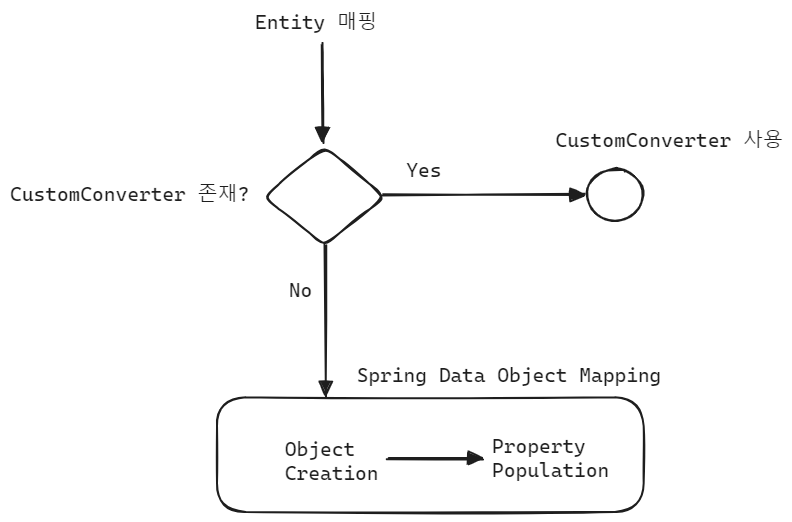

## Spring Data Reactive 의 객채생성 방식과 매핑방식


## intro

아래의 ReactiveMongoTemplate 을 Bean 으로 설정하는 코드를 보면, MongoConverter 와 ReactiveMongoDatabaseFactory 를 주입받아서 ReactiveMongoTemplate 객체를 생성한다는 사실을 알 수 있습니다.

```java
package io.chagchagchag.example_mongo.mongodb_reactive_example.examples.config;

import com.mongodb.reactivestreams.client.MongoClient;
import com.mongodb.reactivestreams.client.MongoClients;
import org.springframework.beans.factory.annotation.Value;
import org.springframework.boot.autoconfigure.mongo.MongoProperties;
import org.springframework.context.annotation.Bean;
import org.springframework.context.annotation.Configuration;
import org.springframework.data.mongodb.ReactiveMongoDatabaseFactory;
import org.springframework.data.mongodb.ReactiveMongoTransactionManager;
import org.springframework.data.mongodb.core.ReactiveMongoTemplate;
import org.springframework.data.mongodb.core.SimpleReactiveMongoDatabaseFactory;
import org.springframework.data.mongodb.core.convert.MongoConverter;

@Configuration
public class MongoReactiveConfiguration {
  @Value("${spring.data.mongodb.uri}")
  private String mongoUri;

  @Bean
  public MongoClient reactiveMongoClient(){
    return MongoClients.create(mongoUri);
  }

  @Bean
  public ReactiveMongoTransactionManager transactionManager(
      ReactiveMongoDatabaseFactory dbFactory
  ){
    return new ReactiveMongoTransactionManager(dbFactory);
  }

  @Bean(name = "bookReactiveMongoDatabaseFactory")
  public SimpleReactiveMongoDatabaseFactory bookReactiveMongoDatabaseFactory(
      MongoProperties mongoProperties,
      MongoClient mongoClient
  ){
    // 이렇게 할 수도 있지만, 하나의 프로젝트에서 여러 몽고 database 를 사용할 수 있으므로 비활성화
//    String database = mongoProperties.getMongoClientDatabase();
    final String database = "book";
    return new SimpleReactiveMongoDatabaseFactory(mongoClient, database);
  }

  @Bean(name = "bookReactiveMongoTemplate")
  public ReactiveMongoTemplate bookReactiveMongoTemplate(
      ReactiveMongoDatabaseFactory bookReactiveMongoDatabaseFactory,
      MongoConverter mongoConverter
  ){
    return new ReactiveMongoTemplate(bookReactiveMongoDatabaseFactory, mongoConverter);
  }
}
```

<br/>


이번 문서에서는 위의 코드에서 처럼 ReactiveMongoTemplate 객체를 만들기 위해 필요한 MongoConverter 를 알아봅니다. MongoConverter 는 객체를 BSON → Java 객체, Java 객체 → BSON 으로 변환해주는 역할을 수행합니다.<br/>

ReactiveMongoTemplate 객체는 생성자가 여러 종류이며, 생성자에 항상 반드시 MongoConverter 객체가 필요한 것은 아닙니다. 위의 코드는 예제를 위해 MongoConverter 를 주입받아서 생성하는 예제를 추가했습니다.<br/>

<br/>


## MongoConverter, MappingMongoConverter

[MongoConverter](https://github.com/spring-projects/spring-data-mongodb/blob/main/spring-data-mongodb/src/main/java/org/springframework/data/mongodb/core/convert/MongoConverter.java) 는 interface 이며 아래와 같이 선언되어 있습니다.

```java
package org.springframework.data.mongodb.core.convert;
public interface MongoConverter extends EntityConverter<MongoPersistentEntity<?>, 
										MongoPersistentProperty, Object, Bson>, 
										MongoWriter<Object>,
										EntityReader<Object, Bson>, CodecRegistryProvider {
	// ... 
}
```

<br/>


[MappingMongoConverter](https://github.com/spring-projects/spring-data-mongodb/blob/main/spring-data-mongodb/src/main/java/org/springframework/data/mongodb/core/convert/MappingMongoConverter.java) 는 대표적인 MongoConverter 타입의 구현체입니다.

```java
package org.springframework.data.mongodb.core.convert;

// ..

public class MappingMongoConverter extends AbstractMongoConverter
		implements ApplicationContextAware, EnvironmentCapable {
    // ...
}
```

<br/>


## MappingMongoConverter 의 매핑과정




## CustomConverter

위의 그림에서 살펴봤듯, Spring Data Mongodb 는 Document 에 해당하는 객체를 생성시에 제일 먼저 CustomConverter 가 있는지를 살피고 CustomConverter 가 존재하면 이 CustomConverter 를 적용합니다.<br/>

Converter 는 Read, Write 용도로 2개를 만들어두어야 합니다.<br/>

아래는 그 예제입니다.<br/>

### ReadingConverter

```java
@ReadingConverter
public class PersonDocumentReadingConverter implements Converter<Document, PersonDocument> {
    @Override
    public PersonDocument convert(Document source){
        ObjectId id = source.getObjectId("_id");
        String name = source.getString("name");
        Integer age = source.getInteger("age");
        return new PersonDocument(id, name, age);
    }
}
```

### WritingConverter

```java
@WritingConverter
public class PersonDocumentWritingConverter implements Converter<PersonDocument, Document> {
    @Override
    public Document convert(PersonDocument source){
        Document document = new Document();
        document.put("_id", source.getId());
        document.put("name", source.getName());
        document.put("age", source.getAge());
        return document;
    }
}
```

<br/>


### CustomConverter 등록 (1)

위에서 생성한 ReadingConverter, WritingConverter 는 아래와 같이 등록 가능합니다.

```java
import org.springframework.context.annotation.Bean;
import org.springframework.context.annotation.Configuration;
import org.springframework.core.convert.converter.Converter;
import org.springframework.data.mongodb.core.convert.MongoCustomConversions;
import org.springframework.data.mongodb.repository.config.EnableMongoRepositories;
import java.util.ArrayList;
import java.util.List;

@Configuration
@EnableMongoRepositories
public class MongoConfig {

    @Bean
    public MongoCustomConversions mongoCustomConversions() {
        List<Converter<?, ?>> converters = new ArrayList<>();
        converters.add(new PersonDocumentReadingConverter());
        converters.add(new PersonDocumentWritingConverter());
        return new MongoCustomConversions(converters);
    }
}
```

<br/>

### CustomConverter 등록 (2)

또는 아래와 같이 등록하는 것도 가능합니다. 

```java
@Configuration
public class ReactiveMongoConfig extends AbstractMongoClientConfiguration{
    @Override
    protected String getDatabaseName(){
        return "helloworld";
    }
    
    @Override
    protected void configureConverters(
        MongoCustomConversions.MongoConverterConfigurationAdapter adapter
    ){
        adapter.registerConverter(new PersonDocumentReadingConverter());
        adapter.registerConverter(new PersonDocumentWritingConverter());
    }
}
```

<br/>


## Spring Data Object Mapping

실제로는 아주 특수한 데이터 파싱이 필요한 것이 아닌 한, 사용자가 직접 CustomConverter 를 등록하지 않아도 되는 경우가 대부분입니다. 사용자 정의 CustomConverter 가 존재하지 않을 경우에는 Spring Data 에서 ObjectMapping 을 하게됩니다. 먼저 Object Creation 을 하기 위해 코딩컨벤션에 맞는 생성자가 맞는지를 찾고, 존재한다면 생성자를 통해 객체를 생성합니다. 만약 코딩컨벤션에 맞는 생성자가 존재하지 않는다면, Property Population 을 진행하는데, `with-` 접두어가 붙은 빌더 메서드를 사용해서 불변성이 유지된 객체를 생성할 수 있습니다.<br/>

- Object Creation
  - 코딩 컨벤션에 맞는 생성자가 있는지를 찾고, 존재한다면 코딩컨벤션에 맞는 생성자를 선택 후 객체를 생성
- Property Population
  - `with-` 접두어가 붙은 빌더 메서드를 사용해서 불변성이 유지된 객체를 생성

<br/>


### Object Creation

일반적인 코딩 컨벤션에 맞는 생성자를 찾아서 객체를 생성하는 절차입니다.

- @PersistenceCreator 애노테이션을 갖는 static factory 메서드가 정확히 하나 존재할 경우 이 팩토리 메서드를 사용합니다.
- @PersistenceCreator 애노테이션을 갖는 constructor 가 있다면 이 constructor 를 사용합니다. 
- 인자가 없는 constructor 가 있을 경우 이 constructor 를 사용합니다.
- constructor 가 하나만 존재한다면, 이 constructor 를 채택해서 사용합니다.

<br/>


### Property Population

Spring Data MongoDB Reactive에서는 `with` 접두어를 가진 빌더 메서드를 사용하여 객체를 생성할 수 있습니다. `with` 접두어를 가진 메서드는 불변성을 유지하고 객체를 간단하게 생성하는 데에 사용됩니다.

r2dbc 에서는 prorperty 가 mutable 해야만 proeprty 의 population 이 가능하지만, Spring Data Mongodb Reactive 에서는 with 메서드를 통해 불변 필드에도 객체생성이 가능 합니다.

```java
import org.springframework.data.annotation.Id;
import org.springframework.data.mongodb.core.mapping.Document;

@Document
public class Product {
    
    @Id
    private String id;
    
    private String name;
    private String description;

    // 생성자는 private으로 선언하여 외부에서 직접 객체를 생성하지 못하도록 합니다.
    private Product() {}

    // with 메서드를 사용하여 객체를 생성하고 필드 값을 설정합니다.
    // name, description 을 인자로 지정하고 with 구문과 함께 사용했다는 사실에 주목해주세요.
    public static Product withNameAndDescription(String name, String description) {
        Product product = new Product();
        product.name = name;
        product.description = description;
        return product;
    }

    // Getter 메서드들은 필요에 따라 정의합니다.
    public String getId() {
        return id;
    }

    public String getName() {
        return name;
    }

    public String getDescription() {
        return description;
    }
}
```


