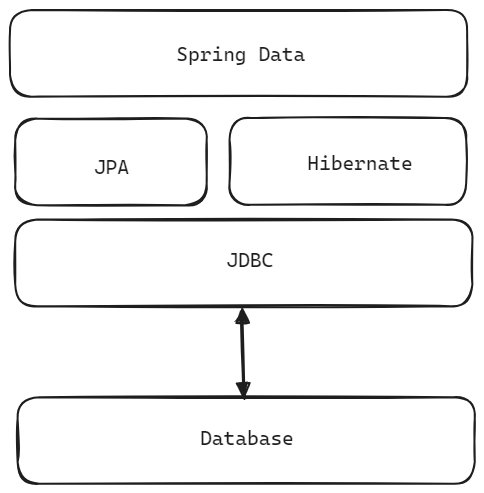
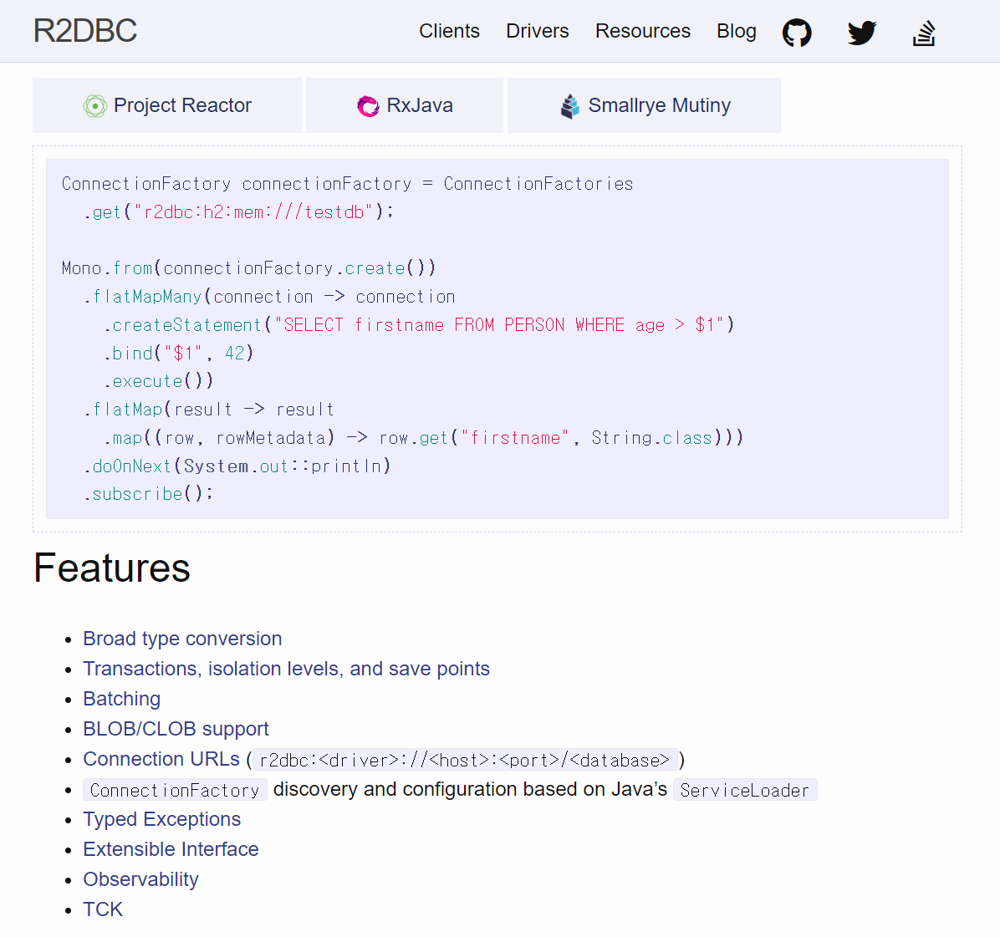

## JDBC, JPA 와의 차이점

## JDBC 기반의 JPA

JDBC, JPA 는 블로킹 기반의 동기(Synchrnoization) 방식의 I/O 연산을 수행합니다. 데이터베이스에 접근해서 커넥션을 획득하고, CRUD 를 수행하기 위해서는 TCP 통신을 수행해야 하는데, JPA 는 JDBC 를 기반으로 이루어져있고 JDBC 는 TCP 통신을 블로킹 기반의 동기(Synchronization)방식으로 수행합니다. 

JDBC 는 굉장히 오래된 라이브러리입니다. AIO와 같은 Java 1.8 이후의 TCP 소켓 통신 스펙(비동기 논블로킹 네트워킹)이 적용되기에는 무리가 있는 라이브러리입니다.  

> 참고 : 블로킹, 논블로킹, 동기, 비동기에 대한 개념은 아래 문서를 참고해주세요.
>
> - [동기 vs 비동기](https://chagchagchag.github.io/docs-spring-webflux/concurrent-programming-basic/sync-vs-async/)
>
> - [블로킹 vs 논블로킹](https://chagchagchag.github.io/docs-spring-webflux/concurrent-programming-basic/blocking-vs-nonblocking/)

 

현재 가장 안정적인 Java LTS 버전은 Java 17 입니다. 그리고 Java 21 이 새로운 LTS 로 떠올랐습니다. JDK1.5 이전부터 작성되었을 JDBC 라이브러리는 더 이상 모던한 애플리케이션에 적합하지 않을지도 모릅니다. 네트워킹을 위한 비동기 논블로킹 TCP 통신 역시 JAVA 8 이후에 도입된 점을 보면, 블로킹 기반의 동기연산을 하는 네트워크 통신을 하는 JDBC는 굉장히 오래되었으며, 최신 모바일 환경에 대응하기에 어려움이 많은 데이터 접근 레이어가 아니지 않나 싶습니다. 

 

**JPA 의 더티체킹** 

JPA 에서 흔히 이야기하는 Write Behind, 변경감지 개념은 r2dbc 환경에서 큰 장점이 되지 못합니다. Write Behind 를 한다는 이야기는 엔티티 캐시를 내부에 보관하고 있는다는 의미이고 다른말로 이야기하면 Mutable 하다는 이야기입니다. 

JPA 에서는 객체의 스냅샷 등을 통해 변경감지를 하는 등의 연산을 통해 엔티티의 변경을 감지하지만, R2DBC 로 넘어오면서 개별 데이터의 흐름을 Immutable 하게 처리하는 R2dbc 에서는 JPA 의 변경감지 기능이 더 이상 필요가 없어졌습니다. 다중 트랜잭션, 분산 트랜잭션 환경을 겪어본다면 더티체킹 개념보다는 이벤트의 트랜잭셔널함에 더 집중을 하게 됩니다. 

따라서 Jpa 의 더티체킹이 R2dbc 에서 지원이 안된다는 점에 실망하지 않으셔도 될 것 같습니다. 

 

## R2DBC

> 참고 : [R2DBC (Reactive Relational Database Connectivity)](https://r2dbc.io/) 

> 이미지 출처 : https://r2dbc.io/

JDBC 는 데이터베이스와 통신을 하는 데에 있어서 동기적이고 블로킹 기반의 통신을 하기 때문에 대규모의 트래픽을 처리하기에 어려움이 많습니다. 반면 R2DBC 는 비동기 논블로킹 네트워크 통신 기반으로 동작하기 때문에 데이터베이스 IO 작업 수행시 애플리케이션의 응답성을 향상시키고, 동시성을 증가시키며, 리액티브 스트림 기반의 연산을 수행하기 때문에 데이터베이스의 변경 사항을 실시간으로 감지하고 처리할 수 있다는 것 역시 장점입니다. 

R2DBC 는 여러 기업과 개발자 커뮤니티에 의해 공동으로 개발되고 유지보수 되어온 오픈소스 프로젝트이며, R2DBC의 주요 컨트리뷰터는 Pivotal 의 개발자들이 대 다수입니다. 

[https://r2dbc.io](https://r2dbc.io) 에서는 아래와 같은 다양한 정보들을 제공하고 있기 때문에 가급적이면 꼭 방문해서 세부적인 내용들을 읽어보시기 바랍니다. 요즘 구글 크롬의 번역기 성능도 좋으니 꼭 번역기를 이용해서 한번씩은 읽어보시길 추천드립니다.

 

