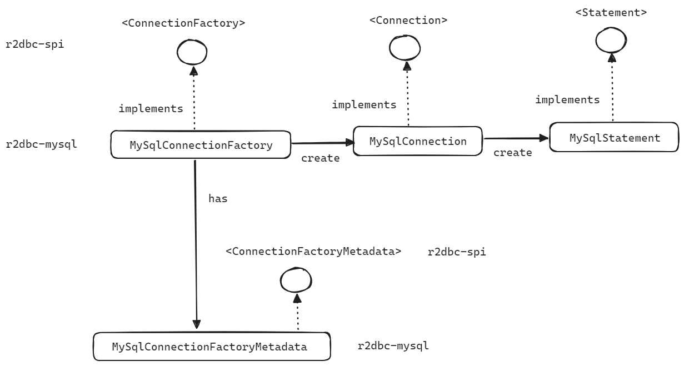

## R2DBC 드라이버, R2DBC SPI, Connection 설정

## DBMS 별 R2DBC 지원 여부

> 참고 : [r2dbc.io/drivers](https://r2dbc.io/drivers/)

사용하려는 데이터베이스에 R2DBC가 지원되는지 여부는 [r2dbc.io/drivers](https://r2dbc.io/drivers/) 에서도 확인 가능하며, Driver Implementations 절에 있는 내용을 정리해보면 아래와 같습니다.<br/>


**kotlin 기반의 MySQL, PostgreSQL Database Driver**

- [jasync-sql](https://github.com/jasync-sql/jasync-sql) - R2DBC wrapper for Java & Kotlin Async Database Driver for MySQL and PostgreSQL (written in Kotlin).

<br/>


**h2**

- [r2dbc-h2](https://github.com/r2dbc/r2dbc-h2) - native driver implemented for H2 as a test database.
- [r2dbc-mariadb](https://github.com/mariadb-corporation/mariadb-connector-r2dbc) - native driver implemented for MariaDB.

<br/>


**mysql, mariadb**

- [r2dbc-mysql](https://github.com/asyncer-io/r2dbc-mysql) - native driver implemented for MySQL (previously [mirromutth/r2dbc-mysql](https://github.com/mirromutth/r2dbc-mysql)).

<br/>


**PostgreSQL**

- [r2dbc-postgresql](https://github.com/pgjdbc/r2dbc-postgresql) - native driver implemented for PostgreSQL.

<br/>


**Oracle**

- [oracle-r2dbc](https://github.com/oracle/oracle-r2dbc) - native driver implemented for Oracle.

<br/>


**MSSQL**

- [r2dbc-mssql](https://github.com/r2dbc/r2dbc-mssql) - native driver implemented for Microsoft SQL Server.

<br/>


**etc**

- [clickhouse-r2dbc](https://github.com/ClickHouse/clickhouse-java/tree/main/clickhouse-r2dbc) - R2DBC wrapper of async Java client for ClickHouse.
- [cloud-spanner-r2dbc](https://github.com/GoogleCloudPlatform/cloud-spanner-r2dbc) - driver for Google Cloud Spanner.

<br/>


이번 문서에서 알아볼 것은 [r2dbc-mysql](https://github.com/asyncer-io/r2dbc-mysql) 입니다.<br/>

<br/>


## r2dbc-mysql

> 참고 : [r2dbc-mysql](https://github.com/asyncer-io/r2dbc-mysql)

r2dbc-mysql 은 r2dbc-spi 와 Reactor Netty 기반으로 이루어진 라이브러리입니다.<br/>

r2dbc-spi(Service Provider Interface) 라는 것은 하나의 interface 이며, [r2dbc-mysql](https://github.com/asyncer-io/r2dbc-mysql) 의 실제 구현은 r2dbc-spi 를 Reactor Netty 기반으로 구현한 구현체로 이루어져 있습니다. Reactor Netty Client 기반으로 네트워킹을 수행하기 때문에 데이터베이스 IO 작업 수행시 애플리케이션의 응답성을 향상시키고, 동시성을 증가시키며, 리액티브 스트림 기반의 연산을 수행하기 때문에 데이터베이스의 변경 사항을 실시간으로 감지하고 처리할 수 있다는 것이 장점입니다.<br/>

<br/>


## R2DBC SPI

> 참고 : [github.com/r2dbc-spi](https://github.com/r2dbc/r2dbc-spi)

R2DBC SPI 에서 SPI 는 Service Provider Interface 라는 용어의 약자입니다.<br/>

우리가 잘 알고 있는 JDBC 역시 JDBC SPI 가 존재하며, DBMS 별로 JDBC SPI 를 구현한 구현체를 통해서 Database 에 접근해서 작업을 수행합니다. <br/>

R2DBC SPI 에는 크게 아래와 같은 주요 타입들이 있습니다.

- Connection 관련 : [Connection](https://github.com/r2dbc/r2dbc-spi/blob/main/r2dbc-spi/src/main/java/io/r2dbc/spi/Connection.java), [ConnectionFactory](https://github.com/r2dbc/r2dbc-spi/blob/main/r2dbc-spi/src/main/java/io/r2dbc/spi/ConnectionFactory.java)
- Exception 관련 : [R2dbcException](https://github.com/r2dbc/r2dbc-spi/blob/main/r2dbc-spi/src/main/java/io/r2dbc/spi/R2dbcException.java), [R2dbcTimeoutException](https://github.com/r2dbc/r2dbc-spi/blob/main/r2dbc-spi/src/main/java/io/r2dbc/spi/R2dbcTimeoutException.java), [R2dbcBadGrammarException](https://github.com/r2dbc/r2dbc-spi/blob/main/r2dbc-spi/src/main/java/io/r2dbc/spi/R2dbcBadGrammarException.java), [R2dbcDataIntegrityViolationException](https://github.com/r2dbc/r2dbc-spi/blob/main/r2dbc-spi/src/main/java/io/r2dbc/spi/R2dbcDataIntegrityViolationException.java) 등
- Result 값 관련 : [Result](https://github.com/r2dbc/r2dbc-spi/blob/main/r2dbc-spi/src/main/java/io/r2dbc/spi/Result.java), [Row](https://github.com/r2dbc/r2dbc-spi/blob/main/r2dbc-spi/src/main/java/io/r2dbc/spi/Row.java), [RowMetadata](https://github.com/r2dbc/r2dbc-spi/blob/main/r2dbc-spi/src/main/java/io/r2dbc/spi/RowMetadata.java)
- Statement 관련 : [Statement](https://github.com/r2dbc/r2dbc-spi/blob/main/r2dbc-spi/src/main/java/io/r2dbc/spi/Statement.java)

<br/>


## r2dbc-mysql Connection 설정



<br/>


r2dbc-mysql 의 MySqlConnectionFactory, MySqlConnection, MySqlStatement, MySqlConnectionFactoryMetadata 는 위와 같은 방식으로 구성되어 있습니다.

- MySqlConnectionFactory : MySqlConnectionFactoryMetadata 객체를 필드로 가지고 있으며, MySqlConnection 객체를 생성합니다.
- MySqlConnection : MySqlConnectionFactory 에서 MySqlConnection 객체를 생성하며, MySqlConnection 을 이용하면 MySqlStatement 객체를 생성하는 것이 가능합니다.

<br/>


### MySqlConnectionFactory

[r2dbc-mysql](https://github.com/asyncer-io/r2dbc-mysql) 의 [MySqlConnectionFactory](https://github.com/asyncer-io/r2dbc-mysql/blob/trunk/r2dbc-mysql/src/main/java/io/asyncer/r2dbc/mysql/MySqlConnectionFactory.java) 클래스는 아래와 같이 구성되어 있습니다.

- create(), getMetadata(), from(), getMySqlConnection(...) 등의 메서드가 있음을 확인 가능합니다.

```java
// ...

public final class MySqlConnectionFactory implements ConnectionFactory {

    private final Mono<? extends MySqlConnection> client;

    private MySqlConnectionFactory(Mono<? extends MySqlConnection> client) {
        this.client = client;
    }

    @Override
    public Mono<? extends MySqlConnection> create() {
        return client;
    }

    @Override
    public ConnectionFactoryMetadata getMetadata() {
        return MySqlConnectionFactoryMetadata.INSTANCE;
    }
    
    public static MySqlConnectionFactory from(MySqlConnectionConfiguration configuration) {
        // ...
    }

    
    private static Mono<MySqlConnection> getMySqlConnection(
        final MySqlConnectionConfiguration configuration,
        final MySqlSslConfiguration ssl,
        final LazyQueryCache queryCache,
        final SocketAddress address,
        final String user,
        @Nullable final CharSequence password
    ) {
        return Mono.fromSupplier(() -> {
            // ...
        }).flatMap(context -> Client.connect(
            // ...
        )).flatMap(client -> {
            // ...
        });
    }

    @Nullable
    private static ZoneId retrieveZoneId(String timeZone) {
        // ...
    }

    private static final class LazyQueryCache implements Supplier<QueryCache> {
        // ...
    }
}
```

MySqlConnectionFactory 의 from() 메서드는 MySqlConnectionConfiguration  객체를 인자로 받아서 MySqlConnectionFactory 객체를 생성하는 것을 확인 가능합니다.<br/>

<br/>


### MySqlConnectionConfiguration

[r2dbc-mysql](https://github.com/asyncer-io/r2dbc-mysql) 의 [MySqlConnectionConfiguration](https://github.com/asyncer-io/r2dbc-mysql/blob/trunk/r2dbc-mysql/src/main/java/io/asyncer/r2dbc/mysql/MySqlConnectionConfiguration.java) 은 아래와 같이 여러가지 Database 의 메타데이터를 세팅할 수 있도록 builder 패턴으로 구현되어 있습니다.

```java
package io.asyncer.r2dbc.mysql;

// ...

/**
 * A configuration of MySQL connection.
 */
public final class MySqlConnectionConfiguration {
    private static final int DEFAULT_PORT = 3306;
    private final boolean isHost;
    private final String domain;
    private final int port;
    private final MySqlSslConfiguration ssl;
    private final boolean tcpKeepAlive;
    private final boolean tcpNoDelay;
    @Nullable
    private final Duration connectTimeout;
    private final boolean preserveInstants;
    
    // ...

    /**
     * Creates a builder of the configuration. All options are default.
     *
     * @return the builder.
     */
    public static Builder builder() {
        return new Builder();
    }
    
    // ...

    /**
     * A builder for {@link MySqlConnectionConfiguration} creation.
     */
    public static final class Builder {
        // ...
        
        public MySqlConnectionConfiguration build() {
            // ...
        }

        public Builder database(@Nullable String database) {
            this.database = database;
            return this;
        }
        
        // ...

        public Builder host(String host) {
            this.domain = requireNonNull(host, "host must not be null");
            this.isHost = true;
            return this;
        }

        public Builder password(@Nullable CharSequence password) {
            this.password = password;
            return this;
        }

        public Builder port(int port) {
            require(port >= 0 && port <= 0xFFFF, "port must be between 0 and 65535");

            this.port = port;
            return this;
        }

        public Builder connectTimeout(@Nullable Duration connectTimeout) {
            this.connectTimeout = connectTimeout;
            return this;
        }

        public Builder user(String user) {
            this.user = requireNonNull(user, "user must not be null");
            return this;
        }
        
        // ...
        
        private Builder() { }
    }
}
```

<br/>

### MySqlConnectionFactory 설정 

위에서 살펴본 `MySqlConnectionFactory` , `MySqlConnectionConfiguration` 클래스를 이용해서 설정 코드를 작성해보면 아래와 같습니다.

```java
package io.chagchagchag.example.r2dbc_example.config;

import io.asyncer.r2dbc.mysql.MySqlConnectionConfiguration;
import io.asyncer.r2dbc.mysql.MySqlConnectionFactory;
import org.springframework.context.annotation.Bean;
import org.springframework.context.annotation.Configuration;
import org.springframework.r2dbc.connection.R2dbcTransactionManager;
import org.springframework.r2dbc.connection.init.ConnectionFactoryInitializer;
import org.springframework.r2dbc.connection.init.ResourceDatabasePopulator;
import org.springframework.transaction.ReactiveTransactionManager;

@Configuration
public class R2dbcMySqlConfig {

  @Bean
  public MySqlConnectionFactory mySqlConnectionFactory(){
    MySqlConnectionConfiguration config = MySqlConnectionConfiguration.builder()
        .host("localhost")
        .port(23306)
        .username("user").password("test1357")
        .database("example")
        .build();

    return MySqlConnectionFactory.from(config);
  }

  @Bean
  public ReactiveTransactionManager transactionManager(MySqlConnectionFactory connectionFactory){
    return new R2dbcTransactionManager(connectionFactory);
  }

  @Bean
  public ConnectionFactoryInitializer initializer(MySqlConnectionFactory connectionFactory){
    ConnectionFactoryInitializer initializer = new ConnectionFactoryInitializer();
    initializer.setConnectionFactory(connectionFactory);
    ResourceDatabasePopulator populator = new ResourceDatabasePopulator();
    initializer.setDatabasePopulator(populator);
    return initializer;
  }

}
```

<br/>

