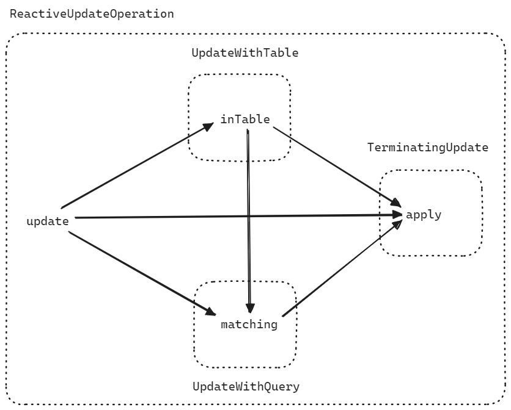
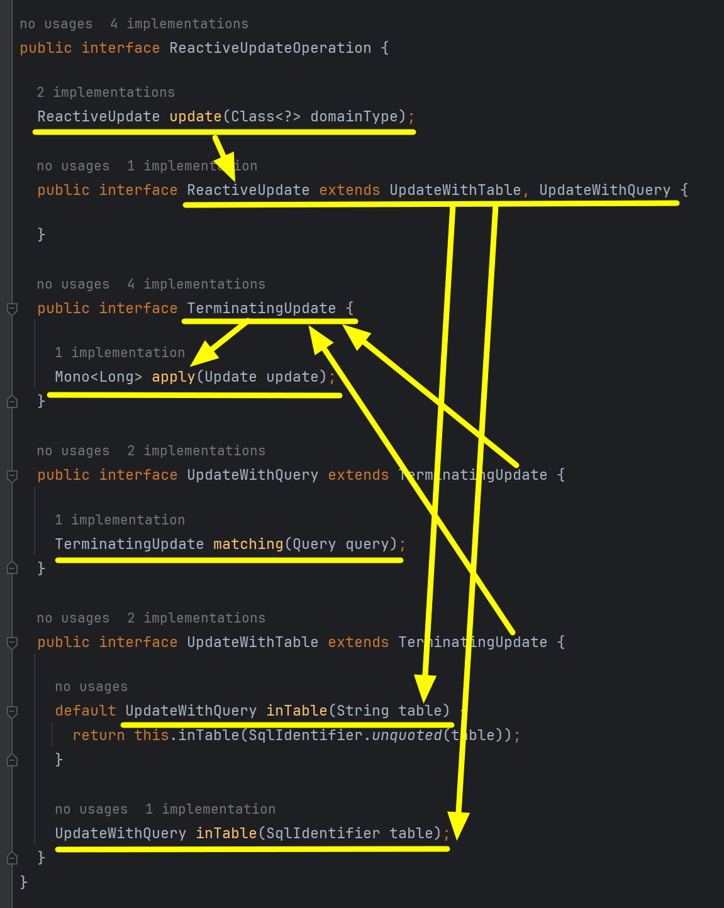
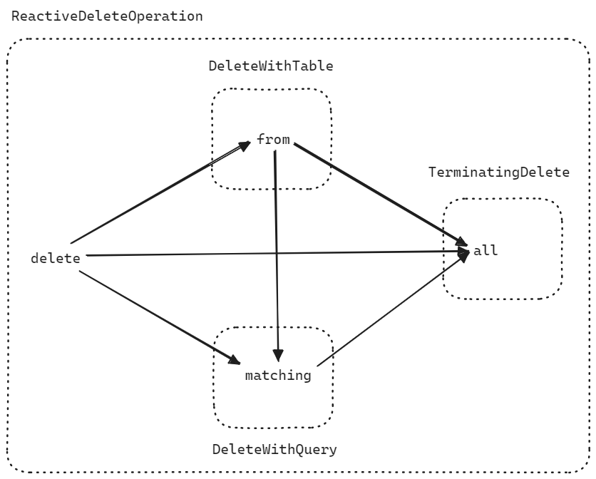
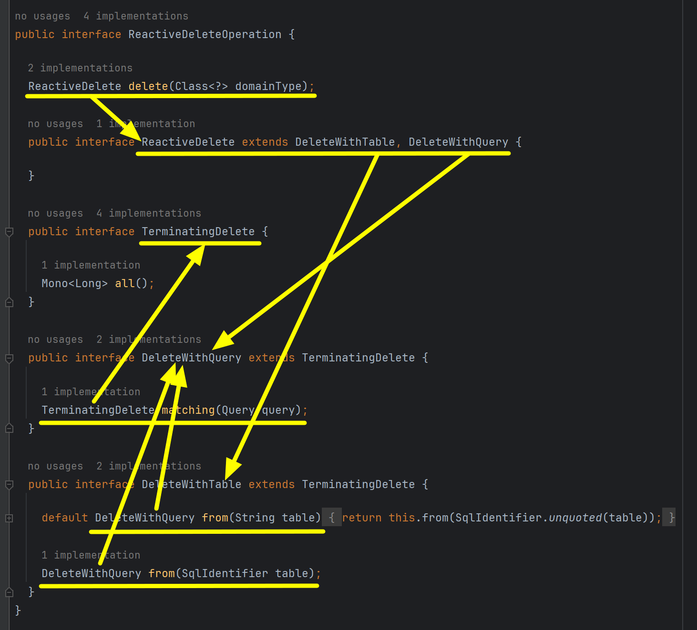

## R2dbcEntityTemplate, R2dbcEntityOperations,  FluentR2dbcOperations

R2dbcEntityTemplate 은 R2dbcEntityOperations 를 implements 하고 있으며, R2dbcEntityOperation 은 기본적으로 필요한 SQL query 들을 메서드로 제공합니다. 그리고 R2dbcEntityOperation 은 FluentR2dbcOperations 를 extends 하고 있는데 이 FluentR2dbcOperations 를 사용하면 QueryDSL 을 사용하는 것처럼 체이닝을 통한 쿼리 수행이 가능합니다.<br/>


예제코드는 [https://github.com/chagchagchag/example-spring-data-r2dbc-mysql](https://github.com/chagchagchag/example-spring-data-r2dbc-mysql) 에서 확인가능합니다.<br/>

<br/>


## 참고

- [A Quick Look at R2DBC With Spring Data](https://www.baeldung.com/spring-data-r2dbc)

<br/>


## FluentR2dbcOperations

R2dbcEntityTemplate 은 R2dbcEntityOperations interface 를 implements 합니다. 그리고 R2dbcEntityOperations 는 FluentR2dbcOperations 를 extends 하고 있습니다. FluentR2dbcOperations 는 ReactiveInsertOperation, ReactiveUpdateOperation, ReactiveSelectOperation, ReactiveDeleteOperation 등의 interface 를 통해 풍부한 연산들을 제공합니다.<br/>


<br/>


- ReactiveInsertOperation : Database 의 insert 쿼리에 해당되는 R2dbc 메서드 들을 제공
- ReactiveSelectOperation : Database 의 select 쿼리에 해당되는 R2dbc 메서드 들을 제공
- ReactiveUpdateOperation : Database 의 update 쿼리에 해당하는 R2dbc 메서드 들을 제공
- ReactiveDeleteOperation : Database 의 delete 쿼리에 해당하는 R2dbc 메서드 들을 제공

<br/>


### insert : (ReactiveInsertOperation)

Insert 쿼리는 아래와 같은 방식으로 체이닝을 거칠수 있습니다.


- insert → into → using
- insert → using

<br/>


#### into 쿼리

into 메서드 내에는 Query 를 실행해야 할 타겟 테이블 명을 전달합니다. String, SqlIdentifer 형태로 전달 가능하며, into가 제공되지 않을 경우 insert() 메서드 내부 정의에 따라 domainType 의 class 명 또는 @Table 애노테이션을 통해서 table 이름이 적용됩니다.<br/>

<br/>


#### using 쿼리

insert 쿼리에서 사용할 Entity 를 using 절에 전달합니다. 전달받은 Entity 는 OutboundRow 로 변환되며, 변환된 OutboundRow 를 통해 쿼리가 실행됩니다.<br/>

<br/>


#### 내부 정의

ReactiveInsertOperation 의 소스코드를 보면 아래와 같이 되어 있습니다. ReactiveInsertOperation 의 진입점은 insert() 메서드로 진입 가능하며, ReactiveInsertOperation interface 내에서는 TerminatingInsert, InsertWithTable 타입을 통해서 각자 체이닝이 가능하도록 되어 있습니다.


<br/>


#### e.g. 단순한 책 데이터 1건 insert

아래는 R2dbcTemplate 을 Bean 으로 설정하는 코드입니다. 자세한 예제는 [example-spring-data-r2dbc-mysql](https://github.com/chagchagchag/example-spring-data-r2dbc-mysql) 을 참고해주세요.

```java
@Bean
public R2dbcEntityTemplate r2dbcEntityTemplate(
  MySqlConnectionFactory connectionFactory
){
return new R2dbcEntityTemplate(connectionFactory);
}
```

<br/>


간단한 Insert 쿼리를 수행하는 코드입니다. 테스트 코드는 아니고 단순 실행문입니다.

```java
package io.chagchagchag.example.r2dbc_example.book;

import io.chagchagchag.example.r2dbc_example.repository.entity.Book;
import org.junit.jupiter.api.DisplayName;
import org.junit.jupiter.api.Test;
import org.slf4j.Logger;
import org.slf4j.LoggerFactory;
import org.springframework.beans.factory.annotation.Autowired;
import org.springframework.boot.test.context.SpringBootTest;
import org.springframework.data.r2dbc.core.R2dbcEntityTemplate;

@SpringBootTest
public class BookR2dbcOperationsInsertTest {
  private static final Logger log = LoggerFactory.getLogger(BookR2dbcOperationsInsertTest.class);

  @Autowired
  private R2dbcEntityTemplate r2dbcEntityTemplate;

  @DisplayName("INSERT_책_데이터_1개_insert")
  @Test
  public void TEST_INSERT_책_데이터_1개_insert(){
    // given
    
    // when
    
    // then
    Book newBook = BookFixtures.newRandomBook("글루코스 혁명", 1L);

    Book inserted = r2dbcEntityTemplate.insert(Book.class)
        .into("book")
        .using(newBook)
        .block();

    log.info("book.name = {}, book.price = {} ", inserted.getName(), inserted.getPrice());
  }
  
}
```

<br/>


### select : (ReactiveSelectOperation)

Select 쿼리는 아래와 같은 방식으로 체이닝을 거칠 수 있습니다.


- select → from → as → matching → 실행
- select → from → matching → 실행
- select → as → matching → 실행
- select → matching → 실행
- select → 실행

<br/>


#### from 쿼리

from() 메서드에는 query 를 실행할 타겟 테이블의 이름을 전달해줘야 합니다. String, SqlIdentifer 형태로 전달 가능하며, from() 메서드가 제공되지 않을 경우 select() 메서드 내부 정의에 따라 domainType 의 class 명 또는 @Table 애노테이션을 통해서 table 이름이 적용됩니다.<br/>

<br/>


#### as 쿼리

Entity 의 모든 필드를 매핑하는 것이 아닌 특정 필드만 mapping 하려고 할 때 사용합니다. 흔히 이야기하는 프로젝션(Projection)을 하고자 할 때 사용합니다. Entity 의 일부 필드만 담고 있는 서브 클래스를 넘겨서 projection 이 가능합니다. <br/>


#### matching 쿼리

Select 쿼리의 where 문에 해당합니다. `Query` 객체를 전달해서 Query 의 where 에 해당하는 조건식을 설정합니다.<br/>


#### termination 쿼리

count, exists, first, one, all 등과 같은 연산을 수행하는 쿼리입니다.

- count() : 조회하려는 데이터 row 의 개수를 반환합니다
- exists() : 조건에 맞는 데이터 row 가 존재하는지 여부를 체크해서 반환합니다.
- first() : 조건에 맞는 첫번째 row 를 반환합니다.
- one() : 조건에 맞는 하나의 row 를 반환합니다. 하나 이상의 row 가 매칭될 경우 Exception 이 발생합니다.
- all() : 조건에 맞는 모든 row 를 반환합니다.

<br/>


#### 내부 정의

ReactiveSelectOperation 의 소스코드를 보면 아래와 같이 되어 있습니다. ReactiveSelectOperation 의 진입점은 select() 메서드로 진입 가능하며, ReactiveSelectOperation interface 내에서는 TerminatingSelect, SelectWithQuery, SelectWithProjection, SelectWithTable 타입을 통해서 각자 체이닝이 가능하도록 되어 있습니다.


<br/>


#### e.g. 간단한 select 

아래는 R2dbcTemplate 을 Bean 으로 설정하는 코드입니다. 자세한 예제는 [example-spring-data-r2dbc-mysql](https://github.com/chagchagchag/example-spring-data-r2dbc-mysql) 을 참고해주세요.

```java
@Bean
public R2dbcEntityTemplate r2dbcEntityTemplate(
  MySqlConnectionFactory connectionFactory
){
return new R2dbcEntityTemplate(connectionFactory);
}
```

<br/>


간단한 Select 쿼리를 수행하는 코드입니다. 테스트 코드는 아니고 단순 실행문입니다.

```java
package io.chagchagchag.example.r2dbc_example.book;

import io.chagchagchag.example.r2dbc_example.repository.entity.Book;
import io.chagchagchag.example.r2dbc_example.repository.valueobject.BookName;
import java.util.List;
import java.util.stream.Collectors;
import org.junit.jupiter.api.DisplayName;
import org.junit.jupiter.api.Test;
import org.slf4j.Logger;
import org.slf4j.LoggerFactory;
import org.springframework.beans.factory.annotation.Autowired;
import org.springframework.boot.test.context.SpringBootTest;
import org.springframework.data.r2dbc.core.R2dbcEntityTemplate;
import org.springframework.data.relational.core.query.Criteria;
import org.springframework.data.relational.core.query.Query;

@SpringBootTest
public class BookR2dbcOperationsSelectTest {
  private static final Logger log = LoggerFactory.getLogger(BookR2dbcOperationsSelectTest.class);

  @Autowired
  private R2dbcEntityTemplate r2dbcEntityTemplate;

  @DisplayName("SELECT_단순한_SELECT_쿼리")
  @Test
  public void TEST_SELECT_단순한_SELECT_쿼리(){
    // given

    // when

    // then
    Criteria equalsBookName = Criteria.where("name").is("글루코스 혁명");
    Criteria priceGt = Criteria.where("price").greaterThan(1000);
    Criteria whereCriteria = equalsBookName.and(priceGt);

    Query where = Query.query(whereCriteria).limit(10);

    List<BookName> selected = r2dbcEntityTemplate.select(Book.class)
        .from("book")
        .as(BookName.class)
        .matching(where)
        .all()
        .toStream()
        .collect(Collectors.toList());

    selected.forEach(bookName -> {
      log.info("book.name = " + bookName);
    });
  }
}
```

<br/>


### update : (ReactiveUpdateOperation)

Update 쿼리는 아래와 같은 방식으로 체이닝을 거칠 수 있습니다.



- update → inTable → matching → apply
- update → inTable → apply
- update → matching → apply
- update → apply

<br/>


#### inTable 쿼리

inTable() 메서드에는 query 를 실행할 타겟 테이블의 이름을 전달해줘야 합니다. String, SqlIdentifer 형태로 전달 가능하며, inTable() 메서드가 제공되지 않을 경우 update() 메서드 내부 정의에 따라 domainType 의 class 명 또는 @Table 애노테이션을 통해서 table 이름이 적용됩니다.<br/>


#### matching 쿼리

Update 쿼리의 where 문에 해당합니다. `Query` 객체를 전달해서 Query 의 where 에 해당하는 조건식을 설정합니다. matching 을 생략할 경우 테이블 내의 모든 로우에 대한 update 를 하겠다는 의미가 됩니다.<br/>


#### apply 쿼리

apply() 메서드는 실제 update 작업을 수행하는 메서드입니다. insert() 와는 다르게 Entity 전체를 전달하는 것이 아니라 Update 객체를 인자값으로 전달합니다. Update 객체는 내부에 Map 타입의 필드가 있는데 이 Map 은 \<SqlIdentifier : Value\> 형식의 데이터를 처리합니다.<br/>

리턴 값으로 쿼리의 수행 결과로 영향을 받는 row 의 수를 리턴합니다.<br/>


#### 내부 정의

ReactiveUpdateOperation 의 소스코드를 보면 아래와 같이 되어 있습니다. ReactiveUpdateOperation 의 진입점은 update() 메서드로 진입 가능하며, ReactiveUpdateOperation interface 내에서는 TerminatingUpdate, UpdateWithQuery, UpdateWithTable 타입을 통해서 각자 체이닝이 가능하도록 되어 있습니다.



<br/>


#### e.g. 간단한 책 데이터 update 

아래는 R2dbcTemplate 을 Bean 으로 설정하는 코드입니다. 자세한 예제는 [example-spring-data-r2dbc-mysql](https://github.com/chagchagchag/example-spring-data-r2dbc-mysql) 을 참고해주세요.

```java
@Bean
public R2dbcEntityTemplate r2dbcEntityTemplate(
  MySqlConnectionFactory connectionFactory
){
return new R2dbcEntityTemplate(connectionFactory);
}
```

<br/>


간단한 Update 쿼리를 수행하는 코드입니다. 테스트 코드는 아니고 단순 실행문입니다.

```java
package io.chagchagchag.example.r2dbc_example.book;

import io.chagchagchag.example.r2dbc_example.repository.entity.Book;
import java.math.BigDecimal;
import org.junit.jupiter.api.DisplayName;
import org.junit.jupiter.api.Test;
import org.slf4j.Logger;
import org.slf4j.LoggerFactory;
import org.springframework.beans.factory.annotation.Autowired;
import org.springframework.boot.test.context.SpringBootTest;
import org.springframework.data.r2dbc.core.R2dbcEntityTemplate;
import org.springframework.data.relational.core.query.Criteria;
import org.springframework.data.relational.core.query.Query;
import org.springframework.data.relational.core.query.Update;

@SpringBootTest
public class BookR2dbcOperationsUpdateTest {
  private static final Logger log = LoggerFactory.getLogger(BookR2dbcOperationsUpdateTest.class);

  @Autowired
  private R2dbcEntityTemplate r2dbcEntityTemplate;

  @DisplayName("간단한_UPDATE_QUERY")
  @Test
  public void TEST_간단한_UPDATE_QUERY(){
    // given

    // when

    // then
    Criteria equalsBookName = Criteria.where("name").is("맛도리여행");
    Criteria priceGt = Criteria.where("price").greaterThanOrEquals(BigDecimal.valueOf(1000));
    Criteria where = equalsBookName.and(priceGt);

    Update update = Update.update("price", BigDecimal.valueOf(10000));

    r2dbcEntityTemplate.update(Book.class)
        .inTable("book")
        .matching(Query.query(where))
        .apply(update)
        .doOnNext(affected -> log.info("affected row count = {}", affected))
        .block();
  }

}
```

<br/>


### delete : (ReactiveDeleteOperation)

Delete 쿼리는 아래와 같은 방식으로 체이닝을 거칠 수 있습니다.



- delete → from → matching → all
- delete → from → all
- delete → matching → all
- delete → all

<br/>


#### from 쿼리

from() 메서드에는 query 를 실행할 타겟 테이블의 이름을 전달해줘야 합니다. String, SqlIdentifer 형태로 전달 가능하며, from() 메서드가 제공되지 않을 경우 delete() 메서드 내부 정의에 따라 domainType 의 class 명 또는 @Table 애노테이션을 통해서 table 이름이 적용됩니다.<br/>


#### matching 쿼리

Delete 쿼리의 where 문에 해당합니다. `Query` 객체를 전달해서 Query 의 where 에 해당하는 조건식을 설정합니다. matching 을 생략할 경우 테이블 내의 모든 로우에 대한 delete 를 하겠다는 의미가 됩니다.<br/>


#### all 쿼리

all() 메서드는 실제 delete 작업을 수행하는 메서드입니다.<br/>

리턴 값으로 delete 쿼리의 수행 결과로 영향을 받는 row 의 수를 리턴합니다.<br/>


#### 내부 정의

ReactiveUpdateOperation 의 소스코드를 보면 아래와 같이 되어 있습니다. ReactiveUpdateOperation 의 진입점은 update() 메서드로 진입 가능하며, ReactiveUpdateOperation interface 내에서는 TerminatingUpdate, UpdateWithQuery, UpdateWithTable 타입을 통해서 각자 체이닝이 가능하도록 되어 있습니다.



<br/>


#### e.g. 간단한 책 데이터 delete

아래는 R2dbcTemplate 을 Bean 으로 설정하는 코드입니다. 자세한 예제는 [example-spring-data-r2dbc-mysql](https://github.com/chagchagchag/example-spring-data-r2dbc-mysql) 을 참고해주세요.

```java
@Bean
public R2dbcEntityTemplate r2dbcEntityTemplate(
  MySqlConnectionFactory connectionFactory
){
return new R2dbcEntityTemplate(connectionFactory);
}
```

<br/>


간단한 Delete 쿼리를 수행하는 코드입니다. 테스트 코드는 아니고 단순 실행문입니다.

```java
package io.chagchagchag.example.r2dbc_example.book;

import io.chagchagchag.example.r2dbc_example.repository.entity.Book;
import java.math.BigDecimal;
import org.junit.jupiter.api.DisplayName;
import org.junit.jupiter.api.Test;
import org.slf4j.Logger;
import org.slf4j.LoggerFactory;
import org.springframework.beans.factory.annotation.Autowired;
import org.springframework.boot.test.context.SpringBootTest;
import org.springframework.data.r2dbc.core.R2dbcEntityTemplate;
import org.springframework.data.relational.core.query.Criteria;
import org.springframework.data.relational.core.query.Query;

@SpringBootTest
public class BookR2dbcOperationsDeleteTest {
  private static final Logger log = LoggerFactory.getLogger(BookR2dbcOperationsDeleteTest.class);
  
  @Autowired
  private R2dbcEntityTemplate r2dbcEntityTemplate;
  
  @DisplayName("간단한_DELETE_QUERY")
  @Test
  public void TEST_간단한_DELETE_QUERY(){
    // given

    // when
    
    // then
    Criteria equalsBookName = Criteria.where("name").is("맛도리여행");
    Criteria priceGt = Criteria.where("price").greaterThanOrEquals(BigDecimal.valueOf(1000));
    Criteria where = equalsBookName.and(priceGt);

    r2dbcEntityTemplate.delete(Book.class)
        .from("book")
        .matching(Query.query(where))
        .all()
        .doOnNext(affected -> log.info("deleted row count = {}", affected))
        .block();
  }
  
}
```

<br/>


## R2dbcEntityOperations

[R2dbcEntityOperations](https://docs.spring.io/spring-data/r2dbc/docs/current/api/org/springframework/data/r2dbc/core/R2dbcEntityOperations.html) 는 위에서 살펴본 FluentR2dbcOperations 에서 제공하는 insert, select, update, delete 연산에 대한 Operation 들 외에도 다양한 종류의 쿼리를 수행할 수 있도록 다양한 메서드 들을 제공하고 있습니다.

- count (Query, Class\<?\> entityClass)
- delete (Query, Class\<?\> entityClass), delete (T)
- exists (Query, Class\<?\> entityClass)
- insert (T)
- select (Query, Class\<?\> entityClass)
- selectOne (Query, Class\<?\> entityClass)
- update (Query, Class\<?\> entityClass), update (T)
- query (PreparedOperation\<?\> operation, Class\<?\> entityClass, Class \<T\> resultType) 및 다양한 오버로딩 된 query(...) 메서드 들


