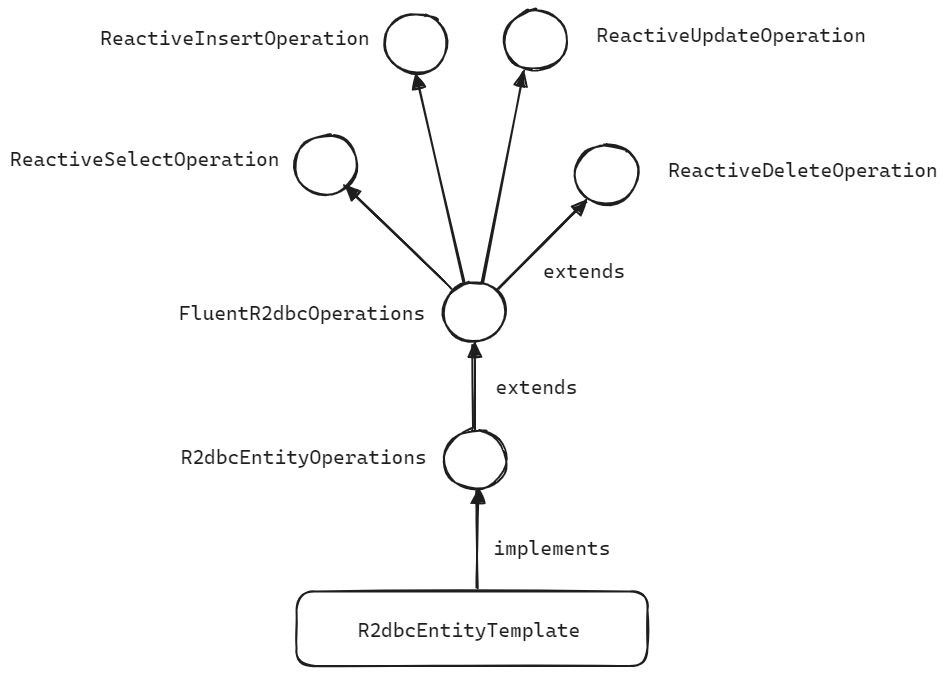
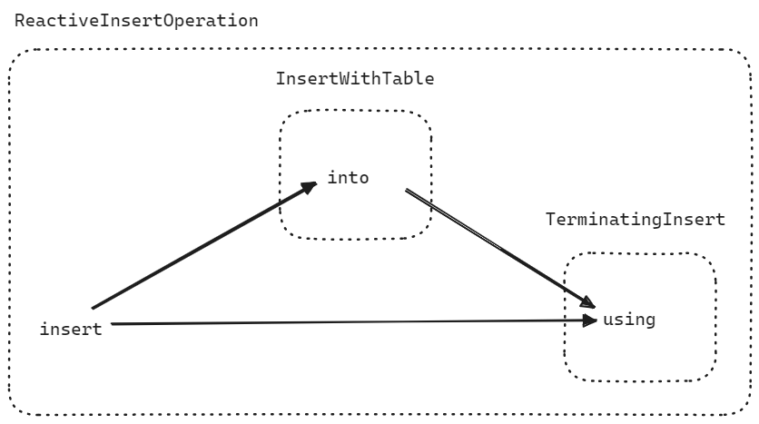
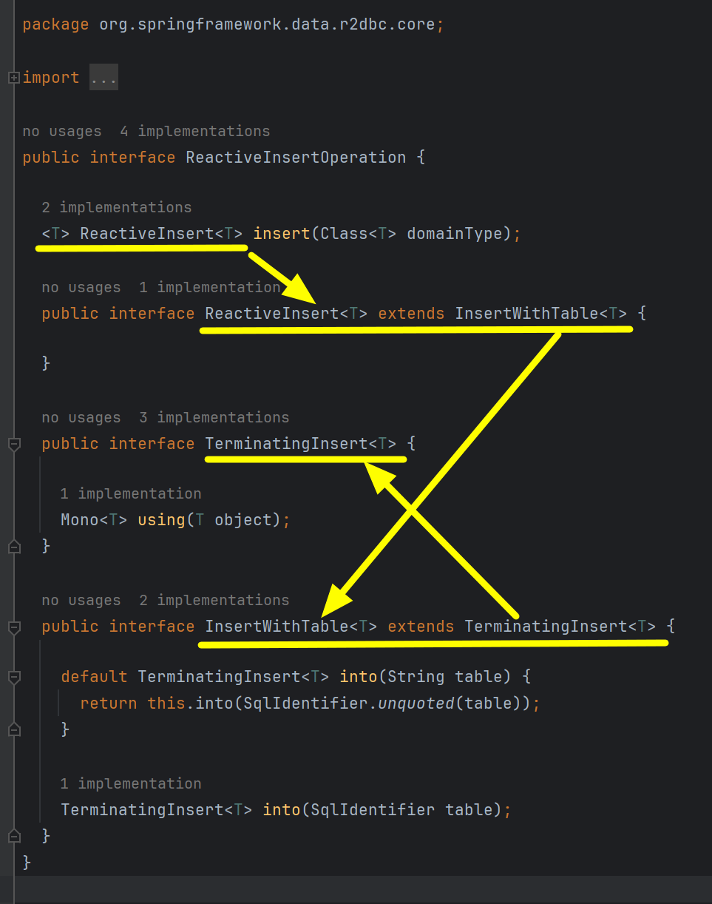
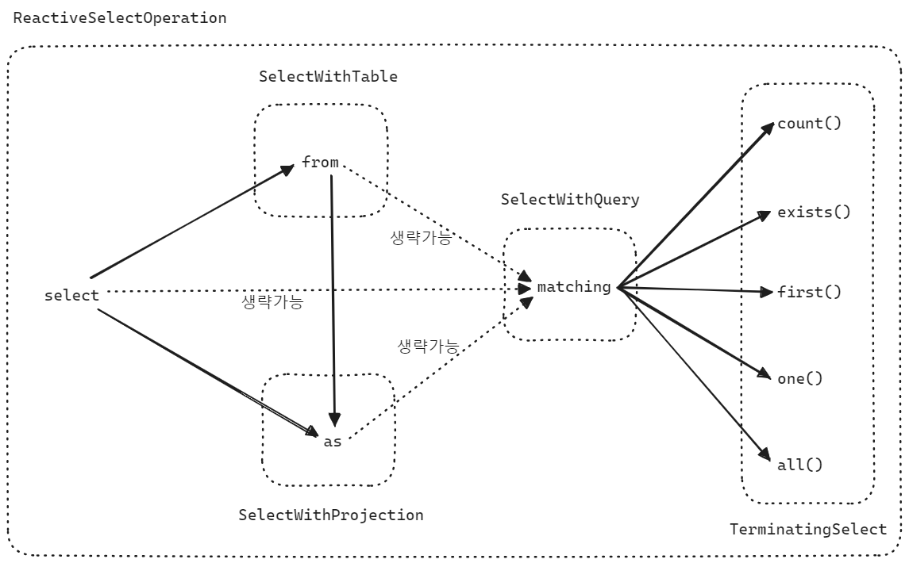
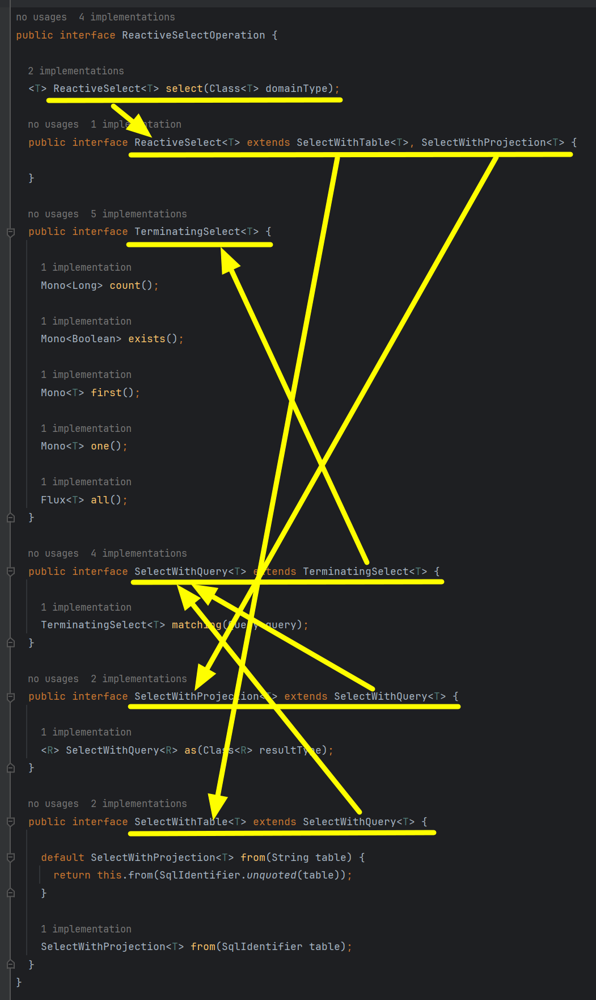

## R2dbcEntityTemplate, R2dbcEntityOperations

<br/>


## FluentR2dbcOperations

R2dbcEntityTemplate 은 R2dbcEntityOperations interface 를 implements 합니다. 그리고 R2dbcEntityOperations 는 FluentR2dbcOperations 를 extends 하고 있습니다. FluentR2dbcOperations 는 ReactiveInsertOperation, ReactiveUpdateOperation, ReactiveSelectOperation, ReactiveDeleteOperation 등의 interface 를 통해 풍부한 연산들을 제공합니다.<br/>



<br/>


- ReactiveInsertOperation : Database 의 insert 쿼리에 해당되는 R2dbc 메서드 들을 제공
- ReactiveSelectOperation : Database 의 select 쿼리에 해당되는 R2dbc 메서드 들을 제공
- ReactiveUpdateOperation : Database 의 update 쿼리에 해당하는 R2dbc 메서드 들을 제공
- ReactiveDeleteOperation : Database 의 delete 쿼리에 해당하는 R2dbc 메서드 들을 제공

<br/>


### insert 쿼리 (ReactiveInsertOperation)

Insert 쿼리는 아래와 같은 방식으로 체이닝을 거칠수 있습니다.



- insert → into → using
- insert → using

<br/>


### into 쿼리

into 메서드 내에는 Query 를 실행해야 할 타겟 테이블 명을 전달합니다. String, SqlIdentifer 형태로 전달 가능하며, into가 제공되지 않을 경우 insert() 메서드 내부 정의에 따라 domainType 의 class 명 또는 @Table 애노테이션을 통해서 table 이름이 적용됩니다.<br/>


### using 쿼리

insert 쿼리에서 사용할 Entity 를 using 절에 전달합니다. 전달받은 Entity 는 OutboundRow 로 변환되며, 변환된 OutboundRow 를 통해 쿼리가 실행됩니다.<br/>

<br/>


### 내부 정의

ReactiveInsertOperation 의 소스코드를 보면 아래와 같이 되어 있습니다. ReactiveInsertOperation 의 진입점은 insert() 메서드로 진입 가능하며, ReactiveInsertOperation interface 내에서는 TerminatingInsert, InsertWithTable 타입을 통해서 각자 체이닝이 가능하도록 되어 있습니다.



<br/>


### e.g.

```java
```

<br/>


### select 쿼리 (ReactiveSelectOperation)

Insert 쿼리는 아래와 같은 방식으로 체이닝을 거칠 수 있습니다.



- select → from → as → matching → 실행
- select → from → matching → 실행
- select → as → matching → 실행
- select → matching → 실행
- select → 실행

<br/>


### from 쿼리

from() 메서드에는 query 를 실행할 타겟 테이블의 이름을 전달해줘야 합니다. String, SqlIdentifer 형태로 전달 가능하며, from() 메서드가 제공되지 않을 경우 select() 메서드 내부 정의에 따라 domainType 의 class 명 또는 @Table 애노테이션을 통해서 table 이름이 적용됩니다.<br/>

<br/>


### as 쿼리

Entity 의 모든 필드를 매핑하는 것이 아닌 특정 필드만 mapping 하려고 할 때 사용합니다. 흔히 이야기하는 프로젝션(Projection)을 하고자 할 때 사용합니다. Entity 의 일부 필드만 담고 있는 서브 클래스를 넘겨서 projection 이 가능합니다. <br/>


### matching 쿼리

Select 쿼리의 where 문에 해당합니다. `Query` 객체를 전달해서 Query 의 where 에 해당하는 조건식을 설정합니다.<br/>


### termination 쿼리

count, exists, first, one, all 등과 같은 연산을 수행하는 쿼리입니다.

- count() : 조회하려는 데이터 row 의 개수를 반환합니다
- exists() : 조건에 맞는 데이터 row 가 존재하는지 여부를 체크해서 반환합니다.
- first() : 조건에 맞는 첫번째 row 를 반환합니다.
- one() : 조건에 맞는 하나의 row 를 반환합니다. 하나 이상의 row 가 매칭될 경우 Exception 이 발생합니다.
- all() : 조건에 맞는 모든 row 를 반환합니다.

<br/>


### 내부 정의

ReactiveSelectOperation 의 소스코드를 보면 아래와 같이 되어 있습니다. ReactiveSelectOperation 의 진입점은 select() 메서드로 진입 가능하며, ReactiveSelectOperation interface 내에서는 TerminatingSelect, SelectWithQuery, SelectWithProjection, SelectWithTable 타입을 통해서 각자 체이닝이 가능하도록 되어 있습니다.



<br/>


### e.g.

<br/>


### update 쿼리 (ReactiveUpdateOperation)

### delete 쿼리 (ReactiveDeleteOperation)


## R2dbcEntityOperations

[R2dbcEntityOperations](https://docs.spring.io/spring-data/r2dbc/docs/current/api/org/springframework/data/r2dbc/core/R2dbcEntityOperations.html) 는 위에서 살펴본 FluentR2dbcOperations 에서 제공하는 insert, select, update, delete 연산에 대한 Operation 들 외에도 다양한 종류의 쿼리를 수행할 수 있도록 다양한 메서드 들을 제공하고 있습니다.

- count (Query, Class\<?\> entityClass)
- delete (Query, Class\<?\> entityClass), delete (T)
- exists (Query, Class\<?\> entityClass)
- insert (T)
- select (Query, Class\<?\> entityClass)
- selectOne (Query, Class\<?\> entityClass)
- update (Query, Class\<?\> entityClass), update (T)
- query (PreparedOperation\<?\> operation, Class\<?\> entityClass, Class \<T\> resultType) 및 다양한 오버로딩 된 query(...) 메서드 들


