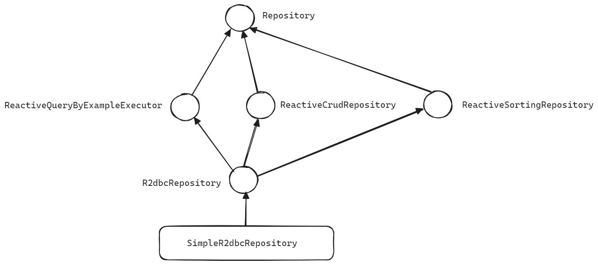

## R2dbcRepository

JPA 에서 흔히 사용하던 Repository 와 유사하게 R2dbc 에서도 Repository 기반의 Data 접근 계층의 코드를 작성하는 것이 가능합니다. 



[ReactiveMongoRepository 문서](https://chagchagchag.github.io/docs-spring-data-reactive/spring-data-mongodb-reactive/reactive-mongo-repository/) 에서 살펴봤던 상속 계층도에서 R2dbcRepository 와 SimpleR2dbcRepository 만 다르고 계층도가 비슷합니다.<br/>


참고

- [SimpleR2dbcRepository\<T,ID\>](https://docs.spring.io/spring-data/r2dbc/docs/current/api/org/springframework/data/r2dbc/repository/support/SimpleR2dbcRepository.html)

- [ReactiveCrudRepository\<T,ID\>](https://docs.spring.io/spring-data/commons/docs/current/api/org/springframework/data/repository/reactive/ReactiveCrudRepository.html)
- [ReactiveQueryByExampleExecutor\<T\>](https://docs.spring.io/spring-data/commons/docs/current/api/org/springframework/data/repository/query/ReactiveQueryByExampleExecutor.html)
- [ReactiveSortingRepository\<T,ID\>](https://docs.spring.io/spring-data/commons/docs/current/api/org/springframework/data/repository/reactive/ReactiveSortingRepository.html)
- [Repository\<T,ID\>](https://docs.spring.io/spring-data/commons/docs/current/api/org/springframework/data/repository/Repository.html)

<br/>


## Component Scan

여러 종류의 Repository 를 사용할 경우가 있는데, 각각의 종류 별로 아래와 같이 리포지터리를 스캔할 수 있도록 설정해줍니다. 아래에서는 ReactiveMongoRepository 와 R2dbc의 컴포넌트 스캔 패키지를 각각 별도로 지정해주었습니다. 실제로 R2dbc, Reactive Mongo 를 함께 쓰는 경우가 많을 수 있기에 아래와 같이 스캔 대상을 명확히 지정해주는 것이 좋습니다.

```java
@EnableReactiveMongoRepositories(
    // ...
)
@EnableR2dbcRepositories(
    basePackages = {"io.chagchagchag.example.r2dbc_example"}
)
@SpringBootApplication
public class R2dbcExampleApplication {

	public static void main(String[] args) {
		SpringApplication.run(R2dbcExampleApplication.class, args);
	}

}
```

<br/>

멀티 모듈 기반으로 프로젝트를 새로 구성 시에 컴포넌트를 스캔할 수 없다는 에러가 나오기도 하는데, 위와 같이 `@Enable***Repositories` 를 명시하지 않아서 나는 에러인 경우가 자주 있습니다. 이 경우에는 위의 코드 처럼 반드시 `@Enable***Repositories` 를 추가해서 리포지터리를 스캔 대상에 추가해두었는지를 확인해주시면 됩니다.<br/>

<br/>


## SimpleReactiveR2dbcRepository


## save 연산 (insert, update 연산)


## 조회 연산 (find 연산)


## 삭제 연산 (delete 연산)


