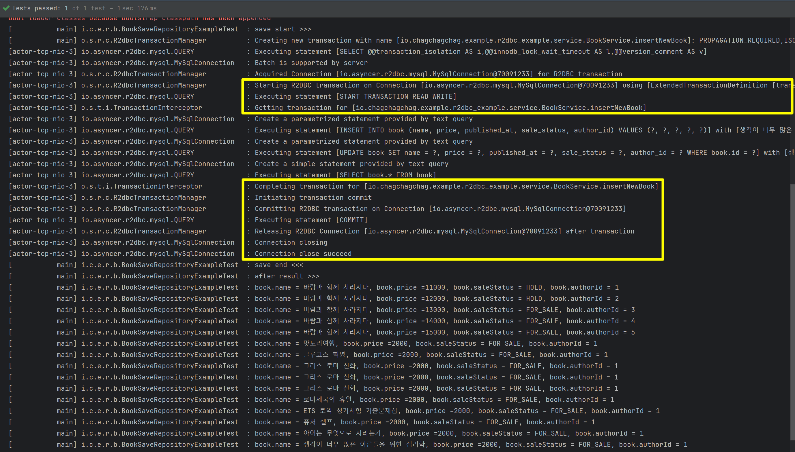
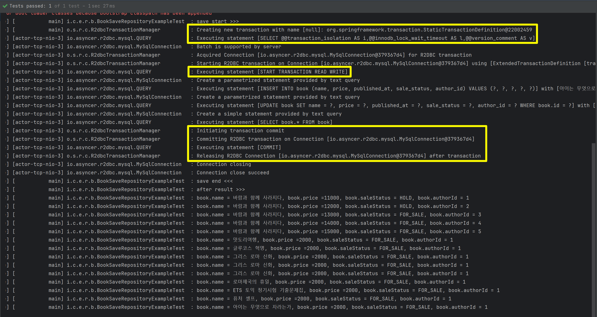
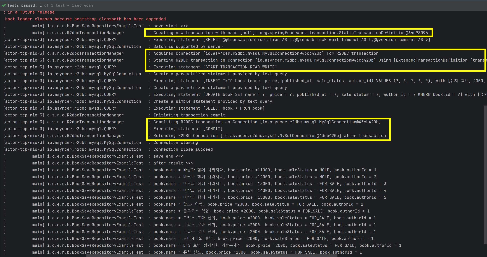

## @Transactional, TransactionalOperator

Spring Data R2dbc 에서 Transactional 기반의 연산을 하는 방식은 아래와 같이 두가지 방식이 있습니다.

- @Transactional 애노테이션을 사용하는 방식
- TransactionalOperator 를 사용하는 방식
  - transactional() 메서드 사용
  - execute() 메서드 사용

<br/>


## mysql

mysql 은 아래의 도커 환경을 사용했습니다.

```yaml
version: '3.7'
services:
  example-mysql:
    image: mysql:5.7.39-debian
    restart: always
    #    command: --lower_case_table_names=1
    container_name: example-mysql
    hostname: example-mysql
    ports:
      - "23306:3306"
    environment:
      - MYSQL_USER=user
      - MYSQL_USER_HOST=%
      - MYSQL_PASSWORD=test1357
      - MYSQL_DATABASE=example
      - MYSQL_ROOT_HOST=%
      - MYSQL_ROOT_PASSWORD=test1357
      - TZ=UTC
    command:
      - --character-set-server=utf8mb4
      - --collation-server=utf8mb4_unicode_ci
    volumes:
      - ./init/:/docker-entrypoint-initdb.d/
```

<br/>

샘플 스키마 및 데이터 INSERT

```sql
CREATE TABLE IF NOT EXISTS example.book
(
    id           bigint auto_increment
        primary key,
    name         varchar(30) not null
) default character set utf8 collate utf8_general_ci;

INSERT INTO example.author(name)
VALUES
    ('찰스'),
    ('1박2일 편집부'),
    ('생로병사 편집부'),
    ('EBS'),
    ('내셔널지오그래픽');


CREATE TABLE IF NOT EXISTS example.book
(
    id           bigint auto_increment
        primary key,
    name         varchar(30) not null,
    price        bigint      null,
    published_at datetime    null,
    sale_status  varchar(20) not null,
    author_id    bigint      not null
) default character set utf8 collate utf8_general_ci;

INSERT INTO example.book(
    name, price, published_at, sale_status, author_id
) VALUES
('바람과 함께 사라지다', 11000, '1950-01-01 00:00:00', 'HOLD', 1),
('바람과 함께 사라지다', 12000, '1950-01-02 00:00:00', 'HOLD', 2),
('바람과 함께 사라지다', 13000, '1950-01-03 00:00:00', 'FOR_SALE', 3),
('바람과 함께 사라지다', 14000, '1950-01-04 00:00:00', 'FOR_SALE', 4),
('바람과 함께 사라지다', 15000, '1950-01-05 00:00:00', 'FOR_SALE', 5)
;
```


## application.yml

로그 내에서 TRACE 레벨로 transaction 이 시작하고 종료됨을 확인하기 위해서 `src/test/resources/application.yml` 에 아래의 내용을 추가해줍니다.

```yaml
logging:
  level:
    org.springframework.transaction.reactive: TRACE
    org.springframework.transaction.interceptor: TRACE
    org.springframework.transaction.ReactiveTransactionManager: TRACE
    org.springframework.transaction.reactive.TransactionalOperator: TRACE
    org.springframework.transaction.reactive.TransactionalOperatorImpl: TRACE
    org.springframework.transaction.reactive.TransactionSynchronizationManager: TRACE
    org.springframework.transaction.reactive.TransactionCallback: TRACE
    org.springframework.transaction.reactive.TransactionContextManager: TRACE
    io.asyncer.r2dbc.mysql.QUERY: trace
    io.asyncer.r2dbc.mysql.MySqlConnection: trace
#    io.asyncer.r2dbc.mysql.client: trace
    org.springframework.r2dbc.connection.R2dbcTransactionManager: TRACE
```

<br/>


## Book, BookFactory

엔티티는 Book.java 라고 하는 클래스이며, 이 엔티티 객체를 생성하는 것은 BookFactory 라는 클래스에서 담당합니다.

### Book.java

```java
package io.chagchagchag.example.r2dbc_example.repository.entity;

import io.chagchagchag.example.r2dbc_example.repository.type.SaleStatus;
import java.math.BigDecimal;
import java.time.LocalDateTime;
import lombok.AccessLevel;
import lombok.AllArgsConstructor;
import lombok.Getter;
import lombok.NoArgsConstructor;
import org.springframework.data.annotation.Id;
import org.springframework.data.relational.core.mapping.Table;

@Table
@Getter
@NoArgsConstructor(access = AccessLevel.PRIVATE)
@AllArgsConstructor
public class Book {
  @Id
  private Long id;
  private String name;
  private BigDecimal price;
//  @Column("published_at") // snake case 와 camel case 가 정확히 일치하면 생략 가능
  private LocalDateTime publishedAt;
//  @Column("sale_status") // snake case 와 camel case 가 정확히 일치하면 생략 가능
  private SaleStatus saleStatus;
}
```

### BookFactory

```java
package io.chagchagchag.example.r2dbc_example.repository.factory;

import io.chagchagchag.example.r2dbc_example.repository.entity.Book;
import io.chagchagchag.example.r2dbc_example.repository.type.SaleStatus;
import java.math.BigDecimal;
import java.time.LocalDateTime;
import org.springframework.stereotype.Component;

@Component
public class BookFactory {
  public Book of(Long id, String name, BigDecimal price, LocalDateTime publishedAt, SaleStatus saleStatus){
    return new Book(id, name, price, publishedAt, saleStatus);
  }

  public Book newBook(String name, BigDecimal price, LocalDateTime publishedAt){
    return of(null, name, price, publishedAt, SaleStatus.WAITING_FOR_SALE);
  }

  public Book withSaleStatus(Book book, SaleStatus saleStatus){
    return of(book.getId(), book.getName(), book.getPrice(), book.getPublishedAt(), book.getSaleStatus());
  }
}
```

<br/>


## Repository

```java
package io.chagchagchag.example.r2dbc_example.repository;

import io.chagchagchag.example.r2dbc_example.repository.entity.Book;
import org.springframework.data.repository.reactive.ReactiveCrudRepository;

public interface BookSaveRepository extends ReactiveCrudRepository<Book, Long> {
}
```

<br/>


## @Transactional 방식의 트랜잭션

### BookService.java

```java
package io.chagchagchag.example.r2dbc_example.service;

import static io.chagchagchag.example.r2dbc_example.repository.type.SaleStatus.FOR_SALE;

import io.chagchagchag.example.r2dbc_example.repository.BookSaveRepository;
import io.chagchagchag.example.r2dbc_example.repository.entity.Book;
import io.chagchagchag.example.r2dbc_example.repository.factory.BookFactory;
import java.math.BigDecimal;
import java.time.LocalDateTime;
import lombok.RequiredArgsConstructor;
import lombok.extern.slf4j.Slf4j;
import org.springframework.stereotype.Service;
import org.springframework.transaction.annotation.Transactional;
import reactor.core.publisher.Flux;

@Slf4j
@RequiredArgsConstructor
@Service
public class BookService {
  private final BookSaveRepository bookSaveRepository;
  private final BookFactory bookFactory;

  @Transactional
  public Flux<Book> insertNewBook(String name, BigDecimal price, Long authorId){
    Book newBook = bookFactory.newBook(name, price, LocalDateTime.now(), authorId);
    return bookSaveRepository.save(newBook)
        .flatMap(book -> {
          Book forSale = bookFactory.withSaleStatus(book, FOR_SALE);
          return bookSaveRepository.save(forSale);
        })
        .thenMany(bookSaveRepository.findAll());
  }

}
```

<br/>


### 테스트 코드

```java
package io.chagchagchag.example.r2dbc_example.book;

import io.chagchagchag.example.r2dbc_example.repository.entity.Book;
import io.chagchagchag.example.r2dbc_example.service.BookService;
import java.math.BigDecimal;
import java.util.List;
import java.util.stream.Collectors;
import org.junit.jupiter.api.DisplayName;
import org.junit.jupiter.api.Test;
import org.slf4j.Logger;
import org.slf4j.LoggerFactory;
import org.springframework.beans.factory.annotation.Autowired;
import org.springframework.boot.test.context.SpringBootTest;

@SpringBootTest
public class BookSaveRepositoryExampleTest {
  private final Logger log = LoggerFactory.getLogger(BookSaveRepositoryExampleTest.class);

  @Autowired
  private BookService bookService;


  @DisplayName("TRANSACTIONAL_ANNOTATION__SAVE_NEW_BOOK")
  @Test
  public void TEST_TRANSACTIONAL_ANNOTATION__SAVE_NEW_BOOK(){
    // given

    // when

    // then
    log.info("save start >>> ");
    List<Book> result = bookService
        .insertNewBook("생각이 너무 많은 어른들을 위한 심리학", BigDecimal.valueOf(2000), 1L)
        .toStream()
        .collect(Collectors.toList());
    log.info("save end <<< ");


    log.info("after result >>> ");
    result.forEach(book -> {
      log.info("book.name = {}, book.price ={}, book.saleStatus = {}, book.authorId = {}",
        book.getName(), book.getPrice(), book.getSaleStatus(), book.getAuthorId()
      );
    });
  }
}
```

<br/>


### 출력결과

출력결과를 보면 Transaction 이 정상적으로 수행됨을 확인 가능합니다.



<br/>


## TransactionalOperator (1) : transactional() 

이번에는 TransactionalOperator 의 transactional() 메서드를 이용해서 트랜잭션을 처리하는 코드입니다.<br/>

### BookService.java

```java
package io.chagchagchag.example.r2dbc_example.service;

import static io.chagchagchag.example.r2dbc_example.repository.type.SaleStatus.FOR_SALE;

import io.chagchagchag.example.r2dbc_example.repository.BookSaveRepository;
import io.chagchagchag.example.r2dbc_example.repository.entity.Book;
import io.chagchagchag.example.r2dbc_example.repository.factory.BookFactory;
import java.math.BigDecimal;
import java.time.LocalDateTime;
import lombok.RequiredArgsConstructor;
import lombok.extern.slf4j.Slf4j;
import org.springframework.stereotype.Service;
import org.springframework.transaction.annotation.Transactional;
import org.springframework.transaction.reactive.TransactionalOperator;
import reactor.core.publisher.Flux;

@Slf4j
@RequiredArgsConstructor
@Service
public class BookService {
  private final BookSaveRepository bookSaveRepository;
  private final BookFactory bookFactory;
  private final TransactionalOperator transactionalOperator;

  // ...
  
  public Flux<Book> insertNewBookTransactionalOperator1(String name, BigDecimal price, Long authorId){
    Book newBook = bookFactory.newBook(name, price, LocalDateTime.now(), authorId);
    Flux<Book> flux = bookSaveRepository.save(newBook)
        .flatMap(book -> {
          Book forSale = bookFactory.withSaleStatus(book, FOR_SALE);
          return bookSaveRepository.save(forSale);
        })
        .thenMany(bookSaveRepository.findAll());
    return transactionalOperator.transactional(flux);
  }
  
  // ...
}
```

<br/>


### 테스트 코드

```java
package io.chagchagchag.example.r2dbc_example.book;

import io.chagchagchag.example.r2dbc_example.repository.entity.Book;
import io.chagchagchag.example.r2dbc_example.service.BookService;
import java.math.BigDecimal;
import java.util.List;
import java.util.stream.Collectors;
import org.junit.jupiter.api.DisplayName;
import org.junit.jupiter.api.Test;
import org.slf4j.Logger;
import org.slf4j.LoggerFactory;
import org.springframework.beans.factory.annotation.Autowired;
import org.springframework.boot.test.context.SpringBootTest;

@SpringBootTest
public class BookSaveRepositoryExampleTest {
  private final Logger log = LoggerFactory.getLogger(BookSaveRepositoryExampleTest.class);

  @Autowired
  private BookService bookService;
  
  // ...

  @DisplayName("TEST_트랜잭셔널_오퍼레이터의_transactional_메서드로_트랜잭션_수행")
  @Test
  public void TEST_트랜잭셔널_오퍼레이터의_transactional_메서드로_트랜잭션_수행(){
    // given

    // when

    // then
    log.info("save start >>> ");
    List<Book> result = bookService
        .insertNewBookTransactionalOperator1("ETS 토익 정기시험 기출문제집", BigDecimal.valueOf(2000), 1L)
        .toStream()
        .collect(Collectors.toList());
    log.info("save end <<< ");


    log.info("after result >>> ");
    result.forEach(book -> {
      log.info("book.name = {}, book.price ={}, book.saleStatus = {}, book.authorId = {}",
          book.getName(), book.getPrice(), book.getSaleStatus(), book.getAuthorId()
      );
    });
  }

}
```

<br/>


### 출력결과



<br/>


## TransactionalOperator (2) : execute() 

### BookService.java

```java
package io.chagchagchag.example.r2dbc_example.service;

import static io.chagchagchag.example.r2dbc_example.repository.type.SaleStatus.FOR_SALE;

import io.chagchagchag.example.r2dbc_example.repository.BookSaveRepository;
import io.chagchagchag.example.r2dbc_example.repository.entity.Book;
import io.chagchagchag.example.r2dbc_example.repository.factory.BookFactory;
import java.math.BigDecimal;
import java.time.LocalDateTime;
import lombok.RequiredArgsConstructor;
import lombok.extern.slf4j.Slf4j;
import org.springframework.stereotype.Service;
import org.springframework.transaction.annotation.Transactional;
import org.springframework.transaction.reactive.TransactionalOperator;
import reactor.core.publisher.Flux;

@Slf4j
@RequiredArgsConstructor
@Service
public class BookService {
  private final BookSaveRepository bookSaveRepository;
  private final BookFactory bookFactory;
  private final TransactionalOperator transactionalOperator;
    
  // ...

  public Flux<Book> insertNewBookTransactionalOperator2(String name, BigDecimal price, Long authorId){
    Book newBook = bookFactory.newBook(name, price, LocalDateTime.now(), authorId);
    Flux<Book> flux = bookSaveRepository.save(newBook)
        .flatMap(book -> {
          Book forSale = bookFactory.withSaleStatus(book, FOR_SALE);
          return bookSaveRepository.save(forSale);
        })
        .thenMany(bookSaveRepository.findAll());
    return transactionalOperator.execute(status -> flux);
  }

}
```

<br/>


### 테스트 코드

```java
package io.chagchagchag.example.r2dbc_example.book;

import io.chagchagchag.example.r2dbc_example.repository.entity.Book;
import io.chagchagchag.example.r2dbc_example.service.BookService;
import java.math.BigDecimal;
import java.util.List;
import java.util.stream.Collectors;
import org.junit.jupiter.api.DisplayName;
import org.junit.jupiter.api.Test;
import org.slf4j.Logger;
import org.slf4j.LoggerFactory;
import org.springframework.beans.factory.annotation.Autowired;
import org.springframework.boot.test.context.SpringBootTest;

@SpringBootTest
public class BookSaveRepositoryExampleTest {
  private final Logger log = LoggerFactory.getLogger(BookSaveRepositoryExampleTest.class);

  @Autowired
  private BookService bookService;
  
  // ...

  @DisplayName("TEST_트랜잭셔널_오퍼레이터의_execute_메서드로_트랜잭션_수행")
  @Test
  public void TEST_트랜잭셔널_오퍼레이터의_execute_메서드로_트랜잭션_수행(){
    // given

    // when

    // then
    log.info("save start >>> ");
    List<Book> result = bookService
        .insertNewBookTransactionalOperator2("퓨처 셀프", BigDecimal.valueOf(2000), 1L)
        .toStream()
        .collect(Collectors.toList());
    log.info("save end <<< ");


    log.info("after result >>> ");
    result.forEach(book -> {
      log.info("book.name = {}, book.price ={}, book.saleStatus = {}, book.authorId = {}",
          book.getName(), book.getPrice(), book.getSaleStatus(), book.getAuthorId()
      );
    });
  }
}
```

<br/>


### 출력결과



