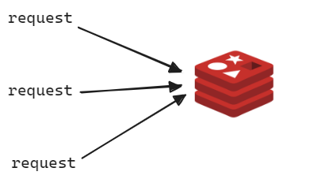
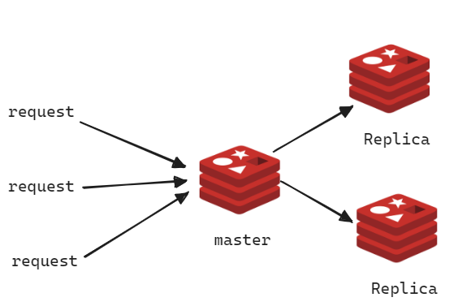
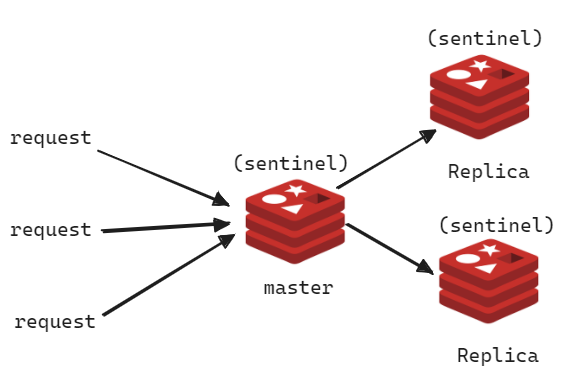
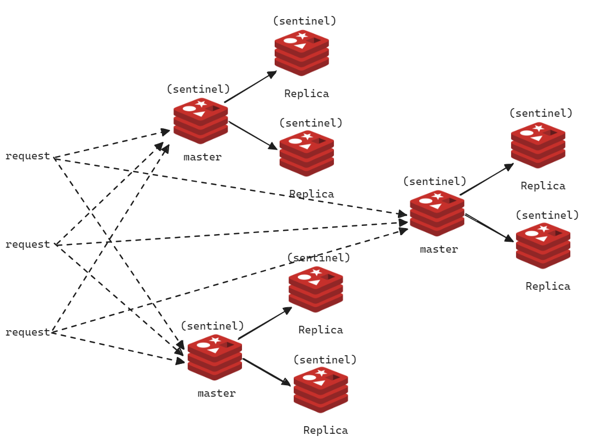

## Redis Replication,Sentinel, Cluster

Redis 를 Single Instance 로 구성할때, Redis Replication 으로 구성할 때, Redis Sentinel 구조로 구성할 때, Cluster 구조로 구성할 때 각각에 대한 장점과 특징을 알아봅니다. 

이 내용을 알아보는 이유는 Redis Connector (Lettuce, Jedis) 중에 Cluster 를 온전히 지원하지 않는 경우가 있기 때문입니다. 

 

## Redis Single Instance

Redis 를 1기로 운영할 때의 모습입니다. 이 경우 1기만 존재하는 Redis 서버가 장애가 생겼을 경우 다른 Client 들의 접속이 불가능하게 됩니다.

 

## Redis Replication

master 와 replication 으로 구성된 Redis 환경입니다. master 에 데이터가 업데이트 되었을 때 master 는 변경사항을 replica 들에 반영하는 Sync 작업을 수행합니다. 각각의 Replica 는 읽기 전용 노드이며, 하나의 노드에 문제가 생기면 다른 Replica 노드에 데이터가 복제되어 있기 때문에 데이터가 유실되지 않습니다. 

하지만 master 에 문제가 생겼을 경우 개발자가 직접 Replica 중 하나를 master 로 변경해주는 작업을 수행해줘야 합니다. 

 

## Redis Sentinel

Redis Replication 의 구조에서 sentinel 의 개념이 추가된 구조입니다. master 에 문제가 생겼을 때는 Replica 각각이 투표를 통해서 master 를 선출하게 됩니다. 만약 장애가 났었던 이전의 master 가 복구가 완료되면 Replica 로 master 를 바라보게 됩니다. 

sentinel 구조로 전환하면 Automatic Failover, 고가용성이 제공된다는 점에서 장점을 갖게 됩니다. 

 

 

## Redis Cluster

Redis Sentinel 들이 모여서 하나의 클러스터를 이루는 것을 의미합니다. 클러스터 구조에서는 데이터를 자동으로 파티셔닝이 가능하며, 고가용성 (High Availability) 을 가지며, Automatic Failover 가 모두 제공된다는 점에서 장점을 가집니다. 

