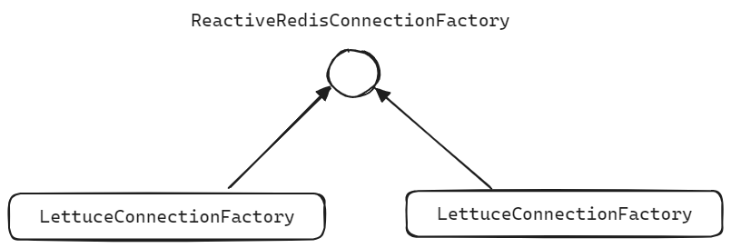
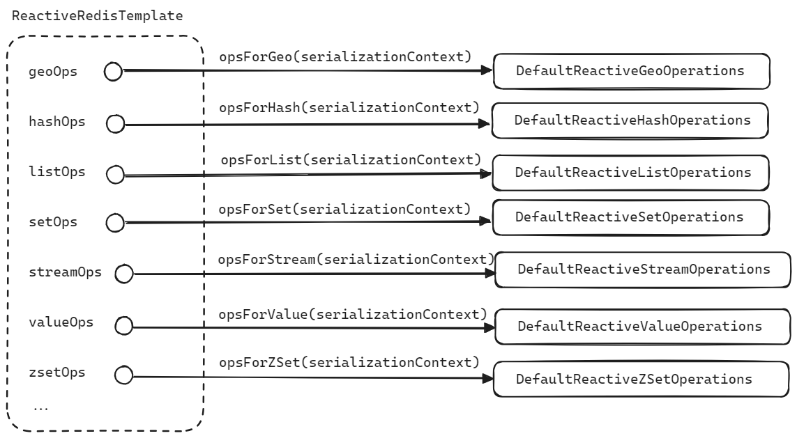
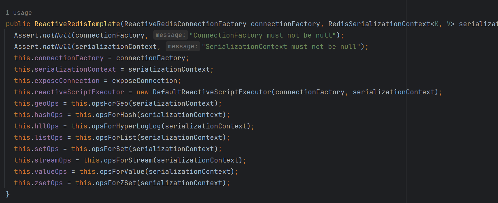
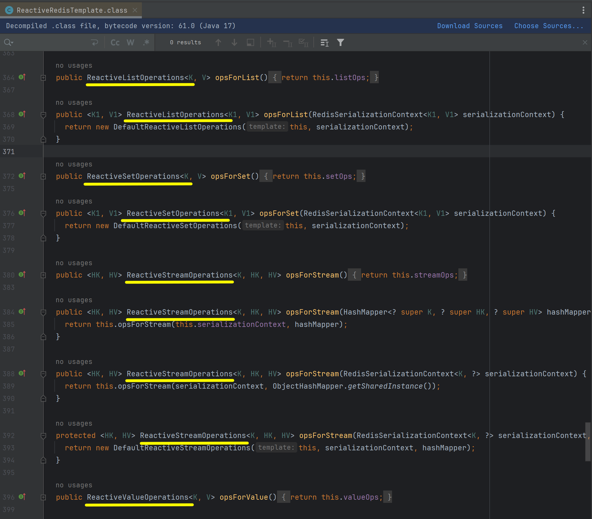

## Spring Data Redis Reactive, RedisOperations


## ReactiveRedisTemplate 설정

ReactieRedisConnectionFactory, ReactiveRedisTemplate 설정을 하는 코드입니다.

```java
package io.chagchagchag.example.example_reactive_redis.config;

import org.springframework.beans.factory.annotation.Value;
import org.springframework.boot.autoconfigure.AutoConfiguration;
import org.springframework.boot.autoconfigure.condition.ConditionalOnBean;
import org.springframework.boot.autoconfigure.data.redis.RedisAutoConfiguration;
import org.springframework.context.annotation.Bean;
import org.springframework.core.io.ResourceLoader;
import org.springframework.data.redis.connection.ReactiveRedisConnectionFactory;
import org.springframework.data.redis.connection.lettuce.LettuceConnectionFactory;
import org.springframework.data.redis.core.ReactiveRedisTemplate;
import org.springframework.data.redis.core.ReactiveStringRedisTemplate;
import org.springframework.data.redis.serializer.JdkSerializationRedisSerializer;
import org.springframework.data.redis.serializer.RedisSerializationContext;

@AutoConfiguration(after = RedisAutoConfiguration.class)
public class ReactiveRedisConfig {

  @Value("${spring.data.redis.host}")
  private String host;

  @Value("${spring.data.redis.port}")
  private int port;

  @Bean(name = "reactiveRedisConnectionFactory")
  public ReactiveRedisConnectionFactory reactiveRedisConnectionFactory(){
    return new LettuceConnectionFactory(host, port);
  }

  @Bean(name = "reactiveRedisTemplate")
  @ConditionalOnBean(ReactiveRedisConnectionFactory.class)
  public ReactiveRedisTemplate<Object, Object> reactiveRedisTemplate(
      ReactiveRedisConnectionFactory reactiveRedisConnectionFactory,
      ResourceLoader resourceLoader
  ){
    JdkSerializationRedisSerializer jdkSerializer = new JdkSerializationRedisSerializer(
        resourceLoader.getClassLoader()
    );

    RedisSerializationContext<Object, Object> serializationContext = RedisSerializationContext
        .newSerializationContext()
        .key(jdkSerializer).value(jdkSerializer)
        .hashKey(jdkSerializer).hashValue(jdkSerializer)
        .build();

    return new ReactiveRedisTemplate<>(reactiveRedisConnectionFactory, serializationContext);
  }

  @Bean(name = "reactiveStringRedisTemplate")
  @ConditionalOnBean(ReactiveRedisConnectionFactory.class)
  public ReactiveStringRedisTemplate reactiveStringRedisTemplate(
      ReactiveRedisConnectionFactory reactiveRedisConnectionFactory
  ){
    return new ReactiveStringRedisTemplate(reactiveRedisConnectionFactory);
  }
}
```

R2dbcEntityTemplate, ReactiveMongoTemplate 을 선언하는 코드에서 봐왔듯  ReactiveRedisTemplate 역시 ConnectionFactory 와 Serializer 또는 Converter 를 인자로 받는 것이 일반적인 코딩 관례입니다.<br/>

아래는 각각 선언한 RedisTemplate 들에 대한 설명입니다.<br/>


**reactiveRedisTemplate**

- JdkSerializerRedisSerializer 를 ReactiveRedisTemplate 의 Serializer 로 선택했습니다. 
- JdkSerializerRedisSerializer 는 ObjectOutputStream 을 이용해서 key, value 로 구성된 Object 를 binary 로 변환합니다.

<br/>

**reactiveStringRedisTemplate**

- key, value 에 대해서 String 형식만 지정할 수 있는 RedisTemplate 을 Bean 으로 등록했습니다.

<br/>


RectiveRedisConnectionFactory 는 interface 이며, 구체타입으로는 LettuceConnectionFactory, JedisConnectionFactory 가 있습니다.



<br/>


## ReactiveRedisTemplate, ReactiveRedisOperations

ReactiveRedisTemplate 클래스 내에는 여러 종류의 RedisOperations 타입들을 구체타입의 인스턴스로 선언하고 있는데, 아래와 같이 바인딩 되어 있습니다. 



<br/>


아래 캡처에서 볼수 있듯 ReactiveRedisTemplate 내부에서는 아래와 같이 여러 종류의 ReactiveRedisOperations 객체들을 종류별로 생성하고 있습니다.



<br/>


그리고 각각의 ReactiveRedisOperations 타입의 구체타입 형태의 필드 들을 실제로 생성하는 팩토리 메서드 역할을 하는 메서드 들은 아래와 같이 다양한 종류로 존재합니다.



<br/>


## 여러가지 종류의 ReactiveOperations

### ReactiveValueOperations

### ReactiveListOperations

### ReactiveHashOperations

### ReactiveZSetOperations

### ReactiveStreamOperations

### ReactiveHyperLogLogOperations


